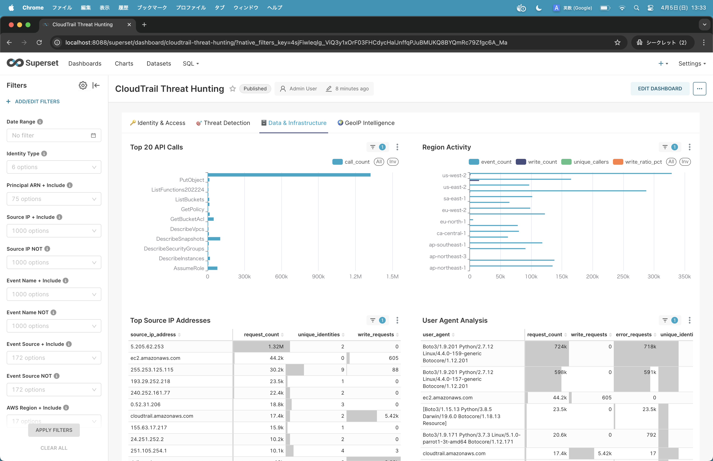

# 🪽THuntCloud🪽


## What is THuntCloud?

### Hunt AWS threats in minutes — no SIEM required, no Cloud infra needed
> Drop in your CloudTrail logs and get 101 ready-to-run threat hunts, a BI dashboard, and AI-assisted analysis
> — all on your laptop with a single `docker compose up`.

[](LICENSE)
[](https://github.com/fukusuket/THuntCloud/actions/workflows/ci.yml)
[](docker/docker-compose.yml)
[](ingester/Cargo.toml)
[](agent/requirements.txt)
[](#-built-in-hunts-builtin_huntsyaml----101-queries)
[](#-dashboard-charts-apache-superset----dashboard----53-charts)

### Key Features
### 🔍 101 Built-in Hunts + AI Chat


### 📊 53 Pre-built Dashboard Charts


### 🗺 AWS Config Resource Graph




### Designed for
- 🔍 Security engineers — investigating AWS account compromise, privilege escalation, or data exfiltration
- 🛡 Cloud security teams — running periodic cloud posture reviews without a dedicated SIEM
- 🧑‍💻 Developers & SREs — quickly auditing their own account's CloudTrail history during or after an incident

---

## Prerequisites

| Requirement                           | Details                                            |
|---------------------------------------|----------------------------------------------------|
| **Docker**                            | Docker Desktop or Docker Engine + Compose v2       |
| **Resources**                         | 8 GB RAM minimum, SSD recommended                  |
| **CloudTrail logs**                   | `.json` or `.json.gz` files exported from AWS      |
| *(Optional)* **AWS Config snapshots** | `.json` or `.json.gz` files for AWS resource graph |
| *(Optional)* **OpenAI API key**       | Required for AI query generation                   |
| *(Optional)* **MaxMind GeoLite2**     | `.mmdb` files for GeoIP enrichment                 |

---

## Quick Start

**Step 1.** Download CloudTrail logs from S3.

```bash
aws s3 cp s3://<your-bucket-prefix> <local-output-dir>/ --recursive --include "*.json.gz"
```

**Step 2.** Clone the repository, ingest logs, and start all services.

```bash
# Clone the repository
git clone https://github.com/fukusuket/THuntCloud.git

# Place the downloaded logs into the Docker logs directory
cp -r <local-output-dir>/ THuntCloud/docker/logs/

# Move to the Docker directory
cd THuntCloud/docker

# Ingest CloudTrail logs into DuckDB
docker compose --profile ingest run --rm ingester ingest --path /data/logs --strip-raw-event

# (Optional) Ingest AWS Config snapshots.
docker compose --profile ingest run --rm ingester config-import --path /data/config

# Start all services (agent + dashboard)
docker compose up -d --build
```

**Step 3.** 🪽 Open your browser and start hunting!🪽

- http://localhost:8501 — Built-in queries and AI Chat
- http://localhost:8088 — Dashboard (`admin` / `admin`)
- http://localhost:8502 — AWS Config resource graph


**(Optional)** GeoIP enrichment.
Place [GeoLite2 `.mmdb` files](https://dev.maxmind.com/geoip/geolite2-free-geolocation-data) in `docker/data/geoip/`, then:

```bash
docker compose --profile ingest run --rm ingester ingest \
  --path /data/logs \
  --geoip-city /data/geoip/GeoLite2-City.mmdb \
  --geoip-asn  /data/geoip/GeoLite2-ASN.mmdb
```

---

## Corporate Proxy / Custom CA Certificate

If you are behind a TLS-inspecting corporate proxy, see [doc/DEVELOPMENT.md](doc/DEVELOPMENT.md#6-corporate-proxy--custom-ca-certificate) for setup instructions.

---

## Modules

| Module | Language | Role | README |
|--------|----------|------|--------|
| `ingester` | Rust 1.85+ | CloudTrail log ingestion (READ_WRITE) | [ingester/README.md](ingester/README.md) |
| `agent` | Python 3.12+ / Streamlit | AI-assisted interactive chat for threat hunting (READ_ONLY) | [agent/README.md](agent/README.md) |
| `dashboard` | Apache Superset 6.1 | BI visualization (READ_ONLY) | [dashboard/README.md](dashboard/README.md) |
| `config_viz` | FastAPI + React | AWS Config visualization (READ_ONLY) | [config_viz/README.md](config_viz/README.md) |


## Built-in Query & Dashboard Reference

> 💡 No SQL or deep AWS knowledge required — just select a hunt from the dropdown and get results instantly.

### 🎯 Built-in Hunts (`builtin_hunts.yaml`) — 101 queries

| Category | Queries | Key Threats Covered |
|----------|:-------:|---------------------|
| 🔑 Identity & Access | 26 | Root usage · console login/MFA · privilege escalation (incl. AttachGroupPolicy/PutGroupPolicy) · AssumeRole · PassRole · Cognito · SSO · Glue DevEndpoint · SageMaker notebook · Data Pipeline · CodeStar · Step Functions · cross-account · credential enumeration |
| 🛡 Detection & Response | 10 | GuardDuty/Config/CloudTrail/Macie tampering · GuardDuty findings read (attacker recon) · WAF · Security Hub · CloudWatch Logs exfiltration · budget deletion |
| 🪣 Data & Storage | 18 | S3 bulk download/deletion · RDS/EBS snapshot sharing · EBS Direct API exfiltration · KMS key ops · S3 public access · backup tampering · DynamoDB export · Kinesis exfiltration · Secrets Manager |
| 🌐 Network & Infrastructure | 15 | SG open to internet · NACL · route table · VPC flow log deletion · Elastic IP / C2 · CloudFront · Network Firewall · ACM certs · VPN/TGW · API Gateway key creation |
| ⚡ Compute & Serverless | 13 | Lambda tampering/layers · SSM lateral movement · EKS · ECR supply chain · ECS task definition backdoor · EventBridge persistence · EC2 user data · mass terminate · Spot Fleet · Lightsail abuse |
| 🕵 Threat Patterns | 5 | Off-hours writes · reconnaissance burst (10+ APIs/hour) · multi-region spread · unusual user agents |
| 📊 Activity & Baseline | 2 | Error spikes · recent errors (24h) |
| ☁ IaC & Platform | 2 | CloudFormation / IaC abuse · CI/CD supply chain |
| 🌍 GeoIP Analysis ✦ | 10 | Country/city/ASN ranking · impossible travel · multi-country credentials · access denied by country |

<details>
<summary>📋 Full list — all 101 queries (click to expand)</summary>

### Built-in Hunts (Streamlit UI — `builtin_hunts.yaml`)

#### 🔑 Identity & Access

| # | Label | Description | SQL |
|---|-------|-------------|-----|
| 1 | 🔑 Root Account Activity | Detects any API call made by the root account | ✅ |
| 2 | 👤 New IAM Users / Keys | Identifies IAM user and access key creation events | ✅ |
| 3 | 🌐 Console Logins | Lists all console login attempts (brute force detection) | ✅ |
| 4 | 🔓 Console Login without MFA | Detects console logins where MFA was not used | ✅ |
| 5 | 🔄 Privilege Escalation (IAM) | Detects IAM policy attachment and role manipulation events (incl. AttachGroupPolicy / PutGroupPolicy) | ✅ |
| 6 | 🔐 AssumeRole Cross-Account | Shows AssumeRole events across different AWS accounts | ✅ |
| 7 | 🚧 IAM Permission Boundary Changes | Detects permission boundary put/delete events | ✅ |
| 8 | 🆔 IAM Identity Center (SSO) Events | Detects AWS IAM Identity Center management actions | ✅ |
| 9 | 🔗 SAML / OIDC Provider Updates | Detects SAML/OIDC identity provider changes (backdoor creation) | ✅ |
| 10 | 🔑 STS Federation Token Issuance | Detects GetFederationToken and GetSessionToken calls | ✅ |
| 11 | 🔄 IAM Role Trust Policy Changes | Detects UpdateAssumeRolePolicy calls (trust backdoor) | ✅ |
| 12 | 👑 User Added to Admin Group | Detects users added to groups with 'admin' in the name | ✅ |
| 13 | 🔐 MFA & Password Changes | Detects MFA deactivation and password resets | ✅ |
| 14 | 🗝 Access Key Abuse | Detects access keys used from 3+ distinct source IPs in 7 days | ✅ |
| 15 | 🔄 Credential Report & Enumeration | Detects IAM enumeration activity (GenerateCredentialReport, ListUsers, etc.) | ✅ |
| 16 | 🏢 Cross-Account Access | Finds events where caller account differs from recipient account | ✅ |
| 17 | 📰 AWS Organizations Account Creation | Detects Organizations account creation and delegated admin changes | ✅ |
| 18 | 👥 Cognito Unauthenticated Access | Detects Cognito Identity Pools with unauthenticated access enabled | ✅ |
| 19 | 🧐 IAM Access Analyzer Calls | Detects any use of IAM Access Analyzer (attacker recon) | ✅ |
| 20 | 🧩 STS AssumeRoleWithWebIdentity | Detects OIDC trust abuse via AssumeRoleWithWebIdentity | ✅ |
| 21 | 🎯 IAM PassRole Abuse | Detects iam:PassRole calls used to escalate privilege via compute services | ✅ |
| 22 | 👥 IAM Group Membership Changes | Detects all AddUserToGroup / RemoveUserFromGroup / CreateGroup events regardless of group name | ✅ |
| 23 | 🧪 Glue DevEndpoint Privilege Escalation | Detects Glue development endpoint creation (iam:PassRole + glue:CreateDevEndpoint) and connection enumeration for credential harvest | ✅ |
| 24 | 🧪 SageMaker Notebook Privilege Escalation | Detects SageMaker notebook creation and presigned URL generation (iam:PassRole + sagemaker:CreateNotebookInstance) | ✅ |
| 25 | 🛠 Data Pipeline / CodeStar Privilege Escalation | Detects Data Pipeline and CodeStar resource creation used for iam:PassRole escalation | ✅ |
| 26 | 🧩 Step Functions Privilege Escalation | Detects Step Functions state machine creation (iam:PassRole + states:CreateStateMachine) | ✅ |

#### 🛡 Detection & Response

| # | Label | Description | SQL |
|---|-------|-------------|-----|
| 1 | 🚫 Access Denied Errors | Groups AccessDenied errors by identity and API | ✅ |
| 2 | 🛡️ GuardDuty Detector Tampering | Detects GuardDuty disable, delete, and threat-intel manipulation | ✅ |
| 3 | ⚙️ AWS Config Tampering | Detects AWS Config recorder/rule deletion | ✅ |
| 4 | 🛑 CloudTrail Tampering | Detects any attempt to stop or modify CloudTrail | ✅ |
| 5 | 📜 CloudWatch Logs Subscription Changes | Detects CW Logs subscription filter creation/deletion (log exfiltration) | ✅ |
| 6 | 🏹 WAF WebACL Changes | Detects WAF WebACL creation, update, and deletion | ✅ |
| 7 | 💰 Budget / Cost Anomaly Changes | Detects deletion or modification of AWS Budgets (hiding cryptomining) | ✅ |
| 8 | ⛔ Security Hub Tampering | Detects Security Hub disable, standard disable, and finding suppression | ✅ |
| 9 | 🚫 AWS Macie Tampering | Detects Macie disable and finding-filter creation (pre-exfiltration evasion) | ✅ |
| 10 | 🔍 GuardDuty Findings Read (Attacker Recon) | Detects read-only GuardDuty calls (ListFindings / GetFindings) — attacker checks what the SOC has already detected | ✅ |

#### 🪣 Data & Storage

| # | Label | Description | SQL |
|---|-------|-------------|-----|
| 1 | 🪣 S3 Data Access Anomalies | Detects bulk GetObject calls (≥100/hour) indicating exfiltration | ✅ |
| 2 | 📸 EC2 Public Snapshot / AMI Sharing | Detects EBS snapshots or AMIs shared publicly (group=all) | ✅ |
| 3 | 🪣 S3 Bucket Policy / ACL Changes | Detects S3 bucket policy and ACL modifications | ✅ |
| 4 | 📂 S3 Versioning / Logging Disabled | Detects S3 versioning suspension and server access logging disable | ✅ |
| 5 | 🔁 S3 Cross-Account Replication | Detects PutBucketReplication (silent object copy to attacker account) | ✅ |
| 6 | 💾 RDS Snapshot Cross-Account Share | Detects RDS/Aurora snapshots shared to external AWS accounts | ✅ |
| 7 | 💣 RDS Deleted without Final Snapshot | Detects RDS deletion with skipFinalSnapshot=true (data destruction) | ✅ |
| 8 | 🔓 S3 Public Access Block Disabled | Detects S3 public access block settings being disabled | ✅ |
| 9 | 🔓 KMS Key Operations | Flags sensitive KMS operations (DisableKey, ScheduleKeyDeletion, Decrypt) | ✅ |
| 10 | 📧 Data Exfiltration Channels | Detects high-volume SNS/SQS/SES/S3 PutObject calls (≥50/hour) | ✅ |
| 11 | 💽 RDS Public Accessibility Enabled | Detects RDS instances with PubliclyAccessible=true | ✅ |
| 12 | 🔥 AWS Backup Tampering | Detects Backup Vault/Plan/RecoveryPoint deletion (ransomware indicator) | ✅ |
| 13 | 💣 S3 Bulk Object Deletion | Detects high-volume DeleteObject calls (≥50/hour) — data destruction pattern | ✅ |
| 14 | 🗄 DynamoDB Export / Bulk Exfiltration | Detects DynamoDB ExportTableToPointInTime and table deletion | ✅ |
| 15 | 🌊 Kinesis Firehose / Stream Exfiltration Channel | Detects Firehose delivery stream creation/update pointing to external S3 | ✅ |
| 16 | 🗝 Secrets Manager Deletion & Cross-Account Policy | Detects Secrets Manager secret deletion and cross-account resource policy changes | ✅ |
| 17 | 📡 SQS / SNS Cross-Account Policy Changes | Detects SQS/SNS policy changes granting access to external accounts | ✅ |
| 18 | 💾 EBS Direct API Snapshot Exfiltration | Detects EBS Direct API (ListSnapshotBlocks / GetSnapshotBlock) — Pacu ebs__download_snapshots bypasses snapshot-sharing detection | ✅ |

#### 🌐 Network & Infrastructure

| # | Label | Description | SQL |
|---|-------|-------------|-----|
| 1 | 🗝️ EC2 Key Pair Creation | Detects CreateKeyPair and ImportKeyPair events (SSH persistence) | ✅ |
| 2 | 🧱 Network ACL Changes | Detects NACL entry creation, deletion, and replacement | ✅ |
| 3 | 🛣️ Route Table Changes | Detects route table modifications (traffic hijacking / MitM) | ✅ |
| 4 | 🌊 VPC Flow Log Changes | Detects deletion of VPC Flow Logs (evidence destruction) | ✅ |
| 5 | 🔥 Security Group Modifications | Detects security group rule changes (port 22/3389, 0.0.0.0/0) | ✅ |
| 6 | 🌍 Security Group Opened to Internet | Finds security group rules allowing traffic from 0.0.0.0/0 | ✅ |
| 7 | 📡 Network Infrastructure Changes | Detects VPC / subnet / IGW / NAT Gateway / peering changes | ✅ |
| 8 | 🖥 Write Events from Management Console | Identifies mutating API calls made via the AWS console | ✅ |
| 9 | 🚧 VPC Endpoint Access Denied | Detects access denied errors via VPC endpoints | ✅ |
| 10 | 📡 Elastic IP Allocation / Association | Detects Elastic IP allocation/association (C2 stable endpoint) | ✅ |
| 11 | 🌐 CloudFront Distribution Tampering | Detects CloudFront origin changes that redirect CDN traffic (MitM) | ✅ |
| 12 | 🛡 Network Firewall / Shield Tampering | Detects Network Firewall and Shield protection removal | ✅ |
| 13 | 🏷 ACM Certificate Operations | Detects ACM certificate requests and deletions (phishing infrastructure) | ✅ |
| 14 | 🧱 VPN / Direct Connect / Transit Gateway | Detects new VPN connections and Transit Gateway attachments (covert tunnels) | ✅ |
| 15 | 🔑 API Gateway Key Creation & Management | Detects API Gateway key creation (Pacu api_gateway__create_api_keys) and authorizer changes that weaken access controls | ✅ |

#### 🕵 Threat Patterns

| # | Label | Description | SQL |
|---|-------|-------------|-----|
| 1 | 🕵 First-Time API Calls (24h) | Finds API calls seen in the last 24h but never before (novel operations) | 🤖 |
| 2 | 🌙 Off-Hours Activity | Flags mutating API calls outside business hours (JST 22:00–06:00) | ✅ |
| 3 | 🔍 Reconnaissance Pattern | Identifies callers who ran 10+ distinct read-only APIs in one hour | ✅ |
| 4 | 🌍 Multi-Region Activity | Detects identities performing writes in 3+ regions in one day | ✅ |
| 5 | 🤖 Unusual User Agents | Lists rare user agents (<5 events) — may indicate attack tooling | ✅ |

#### 📊 Activity & Baseline

| # | Label | Description | SQL |
|---|-------|-------------|-----|
| 1 | ❌ Error Spike Detection | Finds 1-hour windows where error count exceeds daily average by 3× | 🤖 |
| 2 | 🔍 Events with Errors (24h) | Lists all error events in the past 24 hours | ✅ |

#### ⚡ Compute & Serverless

| # | Label | Description | SQL |
|---|-------|-------------|-----|
| 1 | 👤 EC2 Instance Profile Changes | Detects IAM instance profile association and replacement | ✅ |
| 2 | 🖥️ SSM Session / Run Command | Detects SSM StartSession, SendCommand (lateral movement) | ✅ |
| 3 | 🖥 EC2 Instance Launches | Lists all RunInstances events (cryptomining detection) | ✅ |
| 4 | ⚡ Lambda Function Tampering | Detects Lambda creation, code updates, and permission changes | ✅ |
| 5 | 📅 EventBridge / CloudWatch Rule Changes | Detects EventBridge rule and Scheduler modifications (persistence) | ✅ |
| 6 | ⚙️ EKS Cluster API Calls | Detects EKS cluster control-plane modifications (public API endpoint) | ✅ |
| 7 | 🐳 ECR Repository / Image Changes | Detects ECR repository/image events (supply-chain persistence) | ✅ |
| 8 | 📦 Lambda Layer Addition | Detects Lambda layer publication and permission changes | ✅ |
| 9 | 📝 EC2 User Data Modification | Detects ModifyInstanceAttribute with userData change (root exec at boot) | ✅ |
| 10 | 💥 EC2 Mass Stop / Terminate | Detects high-volume StopInstances/TerminateInstances (≥5/hour) — ransomware indicator | ✅ |
| 11 | 💰 EC2 Spot Fleet / Reserved Instance Abuse | Detects large Spot Fleet requests and Reserved Instance purchases (cryptomining) | ✅ |
| 12 | 📦 ECS Task Definition Backdoor | Detects RegisterTaskDefinition / UpdateService — Pacu ecs__backdoor_task_def injects a malicious sidecar without touching ECR | ✅ |
| 13 | 💡 Lightsail Instance & Key Abuse | Detects Lightsail key retrieval, port exposure, and instance access (Pacu lightsail__download_ssh_keys / lightsail__generate_temp_access) | ✅ |

#### ☁ IaC & Platform

| # | Label | Description | SQL |
|---|-------|-------------|-----|
| 1 | 🏗 CloudFormation / IaC Abuse | Detects CloudFormation stack operations (malicious infra deployment) | ✅ |
| 2 | 🛠 CodeBuild / CodePipeline Supply Chain Attack | Detects CI/CD pipeline creation and modification (supply chain attack) | ✅ |

#### 🌍 GeoIP Analysis

> Requires GeoLite2 `.mmdb` files for population (columns are NULL if ingested without GeoIP).

| # | Label | Description | SQL |
|---|-------|-------------|-----|
| 1 | 🌍 Top Source Countries | Ranks source countries by API call volume | ✅ |
| 2 | 🚨 Unusual Country Access | Detects rare country/identity combinations (<10 events) | ✅ |
| 3 | 🏢 Top ASN / Organizations | Lists autonomous systems (ISPs/cloud) by API call volume | ✅ |
| 4 | ⚠ Identity Multi-Country Access | Finds identities calling APIs from 2+ countries (credential theft) | ✅ |
| 5 | 🕵 Impossible Travel Detection | Detects same identity from distant cities within 2 hours | ✅ |
| 6 | 🗺 Console Logins by Country | Maps console login events to their geographic origin | ✅ |
| 7 | 🌐 Private / Internal IP Summary | Summarises events from private/loopback/AWS-internal IPs | ✅ |
| 8 | 🔍 Write Events by Country | Shows mutating API calls grouped by source country | ✅ |
| 9 | 🚫 Access Denied by Country | Groups access denied errors by source country | ✅ |
| 10 | 📍 Top Source Cities | Ranks source cities by event volume | ✅ |

</details>

---

### 📊 Dashboard Charts (Apache Superset — `dashboard/`) — 53 charts

| Tab | Charts | What It Shows |
|-----|:------:|---------------|
| 🔑 Identity & Access | 9 | Console logins · MFA trend · login heatmap (JST) · sensitive APIs · root usage · IAM entity activity · privilege escalation · SSO · Glue/SageMaker privesc |
| 🎯 Threat Detection | 12 | Event volume trend · read/write ratio · throttling · defense evasion · access denied · error trend · Organizations/SCP · first-time services · VPC flow log · Config tampering · NACL/route · EventBridge/CW tampering |
| 📊 API Activity | 7 | Top API calls · region distribution · source IPs · user agents · secrets anomaly · AssumeRole from external IP · Route53 DNS changes |
| 🖥️ Computing | 5 | SSM remote execution · EC2 public snapshot · EKS/ECR container events · ECS task definition backdoor · EBS Direct API exfiltration |
| 🪣 S3 & RDS | 3 | S3 protection config · S3 bucket policy / ACL changes · RDS snapshot cross-account share |
| 🌍 GeoIP Intelligence | 4 | World map · top countries / cities / ASNs by request volume |
| 🕒 Temporal Analysis | 6 | First/last seen per IAM identity / source IP / API call / user agent · dormant accounts reactivated · velocity spikes |
| 🚨 High-Risk API Monitor | 7 | HRM time series · top calls / actors / IPs · defense evasion detail · credential access detail · by region |

<details>
<summary>📋 Full list — all 53 charts (click to expand)</summary>

### Dashboard Charts (Apache Superset — `dashboard/`)

#### 🔑 Identity & Access

| # | Chart Name | Description |
|---|------------|-------------|
| 1 | Console Login Activity | Console sign-in events grouped by IAM identity (DSH-08) |
| 2 | MFA-less Login Trend | Daily console logins split by MFA usage (DSH-28) |
| 3 | Login Activity Heatmap (Hour × Day) | Console login counts by day-of-week and hour-of-day in JST (DSH-19) |
| 4 | Sensitive API Calls | Invocations of known security-sensitive AWS API actions (DSH-12) |
| 5 | Root Account Usage | All API calls made by the AWS Root account (DSH-13) |
| 6 | IAM Entity Activity | Top 50 IAM entities ranked by total API calls, with write ratio and error rate |
| 7 | Privilege Escalation Timeline | Daily counts of privilege-escalation API calls by event name (DSH-30) |
| 8 | IAM Identity Center (SSO) Events | AWS IAM Identity Center management events from sso.amazonaws.com (DSH-44) |
| 9 | Glue & SageMaker Privilege Escalation | Glue DevEndpoint and SageMaker Notebook events used for IAM privilege escalation via iam:PassRole (DSH-50) |

#### 🎯 Threat Detection

| # | Chart Name | Description |
|---|------------|-------------|
| 1 | CloudTrail Events Over Time | Hourly Read vs Write event volume over time (DSH-01) |
| 2 | Write/Read Ratio Trend | Hourly breakdown of read vs write API calls (DSH-20) |
| 3 | Throttling Exception Spikes | Hourly throttling/rate-limit errors by AWS service (DSH-21) |
| 4 | Defense Evasion Events | All CloudTrail events matching known defense-evasion techniques (DSH-22) |
| 5 | Top Access Denied Actions | Top 20 API actions returning AccessDenied errors (DSH-09) |
| 6 | Error Event Trend | Hourly error events broken down by error_code (DSH-04) |
| 7 | Organizations / SCP Changes | AWS Organizations management events including SCP policy changes (DSH-24) |
| 8 | First-Time Service Sources | All distinct AWS service sources ordered by first appearance date (DSH-26) |
| 9 | VPC Flow Log Changes | VPC Flow Log creation and deletion events (DSH-42) |
| 10 | AWS Config Tampering | AWS Config recorder and rule tampering events (DSH-43) |
| 11 | Network ACL / Route Table Changes | NACL and route table modification events (DSH-46) |
| 12 | EventBridge / CloudWatch Rule Tampering | EventBridge and CloudWatch Events rule tampering (DSH-47) |

#### 📊 API Activity

| # | Chart Name | Description |
|---|------------|-------------|
| 1 | Top 20 API Calls | The 20 most frequently called AWS API actions (DSH-02) |
| 2 | Region Activity | Distribution of CloudTrail events across AWS regions (DSH-14) |
| 3 | Top Source IP Addresses | Top 100 external source IPs by request count (DSH-05) |
| 4 | User Agent Analysis | Top 50 user agents by request count with error and write breakdowns (DSH-11) |
| 5 | Secrets Access Anomaly | Identities accessing Secrets Manager or SSM Parameter Store ≥10 times in one hour |
| 6 | AssumedRole from External IP | AssumeRole calls from public (non-private) IP addresses (DSH-27) |
| 7 | Route53 DNS Changes | Route 53 hosted-zone and resolver configuration changes (DSH-29) |

#### 🖥️ Computing

| # | Chart Name | Description |
|---|------------|-------------|
| 1 | SSM Session / Run Command Execution | AWS Systems Manager remote-execution events (DSH-39) |
| 2 | EC2 Public Snapshot / AMI Sharing | EBS snapshot and AMI public-sharing events (DSH-41) |
| 3 | EKS / ECR Container Platform Events | EKS cluster and ECR container registry events (DSH-48) |
| 4 | ECS Task Definition Backdoor | ECS task definition registration and service update events — Pacu ecs__backdoor_task_def pattern (DSH-49) |
| 5 | EBS Direct API Snapshot Exfiltration | EBS Direct API calls (ListSnapshotBlocks / GetSnapshotBlock) used to stream snapshot data without EC2 (DSH-51) |

#### 🪣 S3 & RDS

| # | Chart Name | Description |
|---|------------|-------------|
| 1 | S3 Protection Config Changes | S3 events that weaken bucket security posture (DSH-25) |
| 2 | S3 Bucket Policy / ACL Changes | S3 bucket policy and ACL modification events (DSH-45) |
| 3 | RDS Snapshot Cross-Account Share | RDS and Aurora snapshot sharing events (DSH-40) |

#### 🌍 GeoIP Intelligence

> Requires GeoLite2 `.mmdb` files. GeoIP columns are NULL if ingested without GeoIP.

| # | Chart Name | Description |
|---|------------|-------------|
| 1 | Global Request Origin Map | World map showing geographic distribution of CloudTrail API call origins |
| 2 | Top Countries by Request Volume | Top 20 source countries by API call volume with write-event and unique-caller breakdowns |
| 3 | Top Cities by Request Volume | Top 25 cities by API call volume with write-event and unique-caller breakdowns |
| 4 | Top ASN Organizations by Request Volume | Top 25 ASN organizations by API call volume |

#### 🕒 Temporal Analysis

| # | Chart Name | Description |
|---|------------|-------------|
| 1 | First / Last Seen per IAM Identity | IAM identities with first/last seen timestamps, event counts, and distinct APIs |
| 2 | First / Last Seen per Source IP | Source IPs with first/last seen, distinct identities, and distinct APIs |
| 3 | First / Last Seen per API Call | API actions ordered by first appearance — new calls may indicate novel attack tooling (DSH-33) |
| 4 | First / Last Seen per User Agent | User agents ordered by first appearance — new tooling detection (DSH-34) |
| 5 | Dormant Accounts Reactivated | Identities with inactivity gaps of 72+ hours that resumed activity (DSH-37) |
| 6 | Event Velocity Spikes per Identity | Identities with 50+ events per hour burst activity (DSH-38) |

#### 🚨 High-Risk API Monitor (HRM)

| # | Chart Name | Description |
|---|------------|-------------|
| 1 | High-Risk API Events Over Time | Daily call volume for APIs commonly observed in attack campaigns (HRM-39) |
| 2 | Top High-Risk API Calls | API actions from the high-risk watchlist ranked by total call count (HRM-40) |
| 3 | Top Actors — High-Risk APIs | IAM principals ranked by total calls to high-risk watchlist APIs (HRM-42) |
| 4 | Top Source IPs — High-Risk APIs | Source IPs ranked by total calls to high-risk watchlist APIs (HRM-43) |
| 5 | Defense Evasion API Events | Detailed event log for APIs used to disable or tamper with audit controls (HRM-44) |
| 6 | Credential Access API Events | Detailed event log for APIs used to retrieve secrets and credentials (HRM-45) |
| 7 | High-Risk API Calls by Region | High-risk watchlist API calls distributed by AWS region (HRM-46) |

</details>

---


## Architecture

Four Docker containers share one DuckDB file via a bind mount (`docker/data/db/`).

```
┌────────────────────────────────────────────────────────────────────────┐
│                             Docker Compose                             │
│                                                                        │
│  ┌──────────────┐  ┌──────────────┐  ┌─────────────┐  ┌─────────────┐  │
│  │   ingester   │  │    agent     │  │  config_viz │  │  dashboard  │  │
│  │  (Rust)      │  │  (Streamlit) │  │  (FastAPI+  │  │  (Superset) │  │
│  │              │  │              │  │   React)    │  │             │  │
│  │ CloudTrail   │  │  AI Chat     │  │   Resource  │  │  Visualiz   │  │
│  │ AWS Config   │  │  SQL gen/exec│  │    Graph    │  │             │  │
│  │ ingest       │  │  READ_ONLY   │  │   READ_ONLY │  │   READ_ONLY │  │
│  │ READ_WRITE   │  │              │  │             │  │             │  │
│  └──────┬───────┘  └──────┬───────┘  └────┬────────┘  └─────┬───────┘  │
│         └─────────────────┴───────────────┴─────────────────┘          │
│                                │                                       │
│                         ┌──────▼───────┐                               │
│                         │   DuckDB     │                               │
│                         │ (Bind Mount) │                               │
│                         │   (SSD)      │                               │
│                         └──────────────┘                               │
└────────────────────────────────────────────────────────────────────────┘
```

---

### End-to-End Sequence Diagram

See [doc/ARCHITECTURE.md](doc/ARCHITECTURE.md#end-to-end-sequence-diagram) for the full lifecycle sequence diagram.

---

## License

GNU Affero General Public License v3.0 — see [LICENSE](LICENSE) for details.

## Acknowledgements

This project exists thanks to these wonderful projects and datasets :)

- [Apache Superset](https://superset.apache.org/) — BI platform
- [AWS CloudTrail Lake query samples](https://github.com/aws-samples/cloud-trail-lake-query-samples) — CloudTrail Lake query examples
- [AWS Incident Response](https://github.com/easttimor/aws-incident-response/) - AWS incident response playbooks and tools
- [DuckDB](https://duckdb.org/) — embedded analytical database
- [flaws.cloud](http://flaws.cloud) — intentionally vulnerable AWS CloudTrail dataset
- [MaxMind GeoLite2](https://dev.maxmind.com/geoip/geolite2-free-geolocation-data) — GeoIP databases
- [SIEM on Amazon OpenSearch Service](https://github.com/aws-samples/siem-on-amazon-opensearch-service) — SIEM-like CloudTrail analytics reference implementation
- [Suzaku](https://github.com/Yamato-Security/suzaku) — Suzaku, a CloudTrail log analysis tool created by Yamato Security
- [Yamato Security](https://github.com/Yamato-Security) — [suzaku-sample-data](https://github.com/Yamato-Security/suzaku-sample-data)
