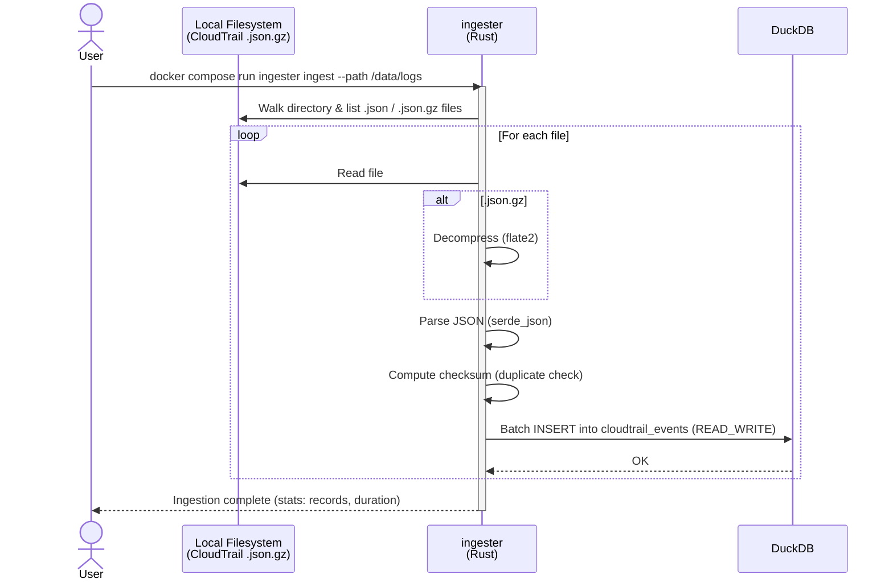
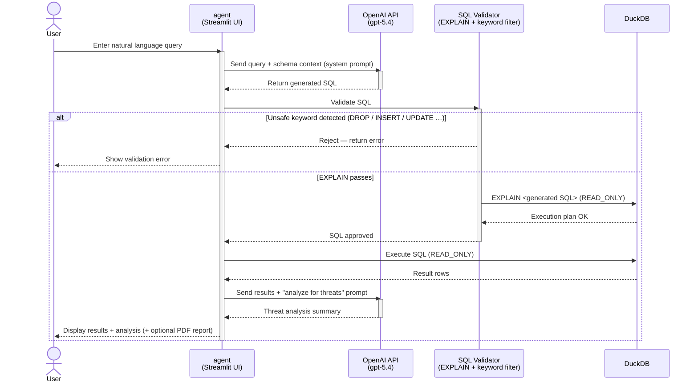
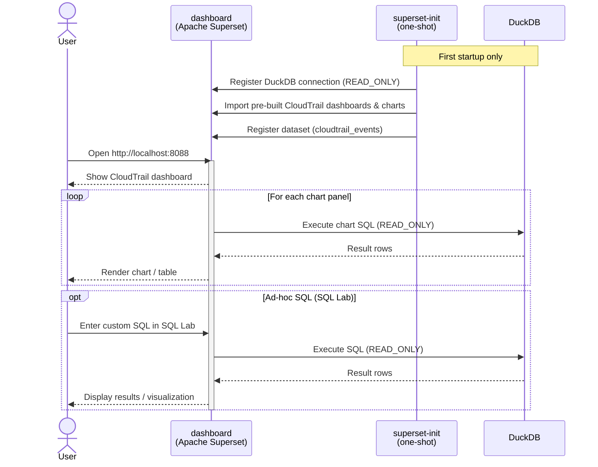

# 🪽THuntCloud🪽

## AWS Log Threat Hunting Tool

> Locally-executed, AI-assisted threat hunting for AWS CloudTrail logs — no SIEM required.

[](LICENSE)
[](docker/docker-compose.yml)
[](ingester/Cargo.toml)
[](agent/requirements.txt)

## Overview

THuntCloud enables fast, AI-powered threat hunting against AWS CloudTrail logs directly on a local PC.

- **No SIEM required** — all analysis runs locally via DuckDB
- **AI-assisted** — natural language → SQL generation via OpenAI API (`gpt-5.4`)
- **High performance** — ingest 10 GB in under 5 minutes; supports 50 GB on 16 GB RAM
- **GeoIP enrichment** — enrich `source_ip_address` with country, city, ASN via MaxMind GeoLite2
- **Built-in dashboard** — Apache Superset with pre-seeded CloudTrail dashboards
- **Single-command launch** — `docker compose up -d`

## Screenshots

### AI Agent (Streamlit UI)


### Dashboard (Apache Superset)


## Architecture

```
┌─────────────────────────────────────────────────────────┐
│                    Docker Compose                       │
│                                                         │
│  ┌──────────────┐   ┌──────────────┐  ┌─────────────┐   │
│  │   ingester   │   │    agent     │  │  dashboard  │   │
│  │  (Rust)      │   │  (Streamlit) │  │  (Superset) │   │
│  │              │   │              │  │             │   │
│  │ CloudTrail   │   │  AI-Agent    │  │ BI / Viz    │   │
│  │ gz ingest    │   │ SQL gen/exec │  │             │   │
│  │ READ_WRITE   │   │ READ_ONLY    │  │ READ_ONLY   │   │
│  └──────┬───────┘   └──────┬───────┘  └──────┬──────┘   │
│         └──────────────────┴─────────────────┘          │
│                            │                            │
│                    ┌───────▼──────┐                     │
│                    │   DuckDB     │                     │
│                    │  (Named Vol) │                     │
│                    │  (SSD)       │                     │
│                    └──────────────┘                     │
└─────────────────────────────────────────────────────────┘
```

## Processing Sequence

### 1. Log Ingestion Flow



### 2. AI-Assisted Threat Hunting Flow



### 3. Dashboard Visualization Flow



---

## Quick Start

### Prerequisites

- Docker Desktop (or Docker Engine + Docker Compose v2)
- 16 GB RAM minimum, SSD recommended
- OpenAI API key (`gpt-5.4` access) — agent module requires this
- *(Optional)* [MaxMind GeoLite2](https://dev.maxmind.com/geoip/geolite2-free-geolocation-data) `.mmdb` files for GeoIP enrichment

### 1. Clone and configure

```bash
git clone https://github.com/fukusuket/THuntCloud.git
cd THuntCloud
```

### 2. Place CloudTrail logs

```bash
# Your own logs
cp /path/to/cloudtrail/logs/*.json.gz docker/logs/
```

### 3. Build and ingest logs

```bash
cd docker
docker compose --profile ingest build ingester
docker compose --profile ingest run --rm ingester ingest --path /data/logs
```

#### With GeoIP enrichment (optional)

Download [GeoLite2 `.mmdb` files](https://dev.maxmind.com/geoip/geolite2-free-geolocation-data) and place them in `docker/data/geoip/`.

```
docker/
└── data/
    └── geoip/                        ← place .mmdb files here
        ├── GeoLite2-City.mmdb
        ├── GeoLite2-Country.mmdb
        └── GeoLite2-ASN.mmdb
```

These files are bind-mounted read-only into the container at `/data/geoip/`.  
Three database types are supported:

| Flag | Database | Provides |
|------|----------|----------|
| `--geoip-city` | GeoLite2-City.mmdb | Country + city + lat/lon |
| `--geoip-country` | GeoLite2-Country.mmdb | Country only (lighter alternative to City) |
| `--geoip-asn` | GeoLite2-ASN.mmdb | ASN number + organization name |

**Full enrichment (City + ASN):**

```bash
docker compose --profile ingest run --rm ingester ingest \
  --path /data/logs \
  --geoip-city /data/geoip/GeoLite2-City.mmdb \
  --geoip-asn  /data/geoip/GeoLite2-ASN.mmdb
```


```bash
docker compose --profile ingest run --rm ingester ingest --path /data/logs
```

#### Back-fill GeoIP on an existing database

If logs were already ingested without GeoIP, use the `enrich` subcommand to back-fill the geo columns without re-ingesting.  
Place `.mmdb` files in `docker/data/geoip/` first, then:

```bash
# Full enrichment (City + ASN)
docker compose --profile ingest run --rm ingester enrich \
  --geoip-city /data/geoip/GeoLite2-City.mmdb \
  --geoip-asn  /data/geoip/GeoLite2-ASN.mmdb

```

### 4. Start all services

```bash
docker compose up -d --build
```

### 5. Open the UIs

| Service | URL | Credentials |
|---------|-----|-------------|
| Agent (AI hunting) | http://localhost:8501 | — |
| Dashboard (Superset) | http://localhost:8088 | `admin` / `admin` |

---

## Docker Operations

All commands are run from the `docker/` directory.

```bash
docker compose down && docker compose up -d              # Restart (keep data)
docker compose down && docker compose up -d --build      # Rebuild & restart
docker compose up -d superset                            # Dashboard only
docker compose up -d agent                               # Agent only
docker compose logs -f                                   # View logs
docker compose down -v                                   # Full reset (delete data)
```

### Re-ingest Logs

```bash
docker compose down
rm -f data/db/threat_hunting.db data/db/threat_hunting.db.wal
docker compose --profile ingest run --rm ingester ingest --path /data/logs
docker compose up -d --build
```

---

## ingester CLI Reference

```
ingester ingest --path <dir>
                [--db             <path>]    # DuckDB file (default: /data/db/threat_hunting.db)
                [--include        <globs>]   # comma-separated include patterns, e.g. "*CloudTrail*"
                [--exclude        <globs>]   # comma-separated exclude patterns, e.g. "*vpcflowlogs*"
                [--from           <YYYYMMDD>]# ingest files on or after this date
                [--to             <YYYYMMDD>]# ingest files on or before this date
                [--workers        <N>]       # parallel threads (default: CPU count)
                [--geoip-city     <path>]    # GeoLite2-City.mmdb    (or GEOIP_CITY_PATH env)
                [--geoip-country  <path>]    # GeoLite2-Country.mmdb (or GEOIP_COUNTRY_PATH env)
                [--geoip-asn      <path>]    # GeoLite2-ASN.mmdb     (or GEOIP_ASN_PATH env)

ingester enrich
                [--db             <path>]    # DuckDB file (default: /data/db/threat_hunting.db)
                [--geoip-city     <path>]    # GeoLite2-City.mmdb    (or GEOIP_CITY_PATH env)
                [--geoip-country  <path>]    # GeoLite2-Country.mmdb (or GEOIP_COUNTRY_PATH env)
                [--geoip-asn      <path>]    # GeoLite2-ASN.mmdb     (or GEOIP_ASN_PATH env)
```
---

## Module Overview

| Module | Language / Framework | Role |
|--------|---------------------|------|
| `ingester` | Rust 1.85+ | Parse and load CloudTrail logs into DuckDB; optional GeoIP enrichment (READ_WRITE) |
| `agent` | Python 3.12+ / Streamlit | AI-Agent UI for interactive threat hunting (READ_ONLY) |
| `dashboard` | Apache Superset | BI visualization of log data (READ_ONLY) |

## License

Apache License 2.0 — see [LICENSE](LICENSE) for details.
See [NOTICE](NOTICE) for third-party license attributions.

## Acknowledgements

- **[Yamato Security](https://github.com/Yamato-Security)** — for providing the [suzaku-sample-data](https://github.com/Yamato-Security/suzaku-sample-data) repository
- **[flaws.cloud](http://flaws.cloud)** — the intentionally vulnerable AWS environment whose CloudTrail logs serve as an excellent threat hunting practice dataset.
- **[Apache Superset](https://superset.apache.org/)** — the open-source BI platform powering the built-in dashboard.
- **[DuckDB](https://duckdb.org/)** — the embedded analytical database at the core of THuntCloud's data engine.
- **[siem-on-amazon-opensearch-service](https://github.com/aws-samples/siem-on-amazon-opensearch-service)** — AWS sample project for SIEM on Amazon OpenSearch Service, referenced for log parsing and normalization patterns.
- **[cloud-trail-lake-query-samples](https://github.com/aws-samples/cloud-trail-lake-query-samples)** — AWS sample queries for CloudTrail Lake, referenced for threat hunting query patterns.
