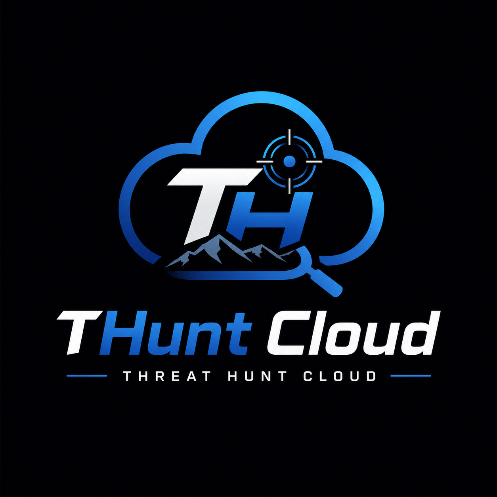
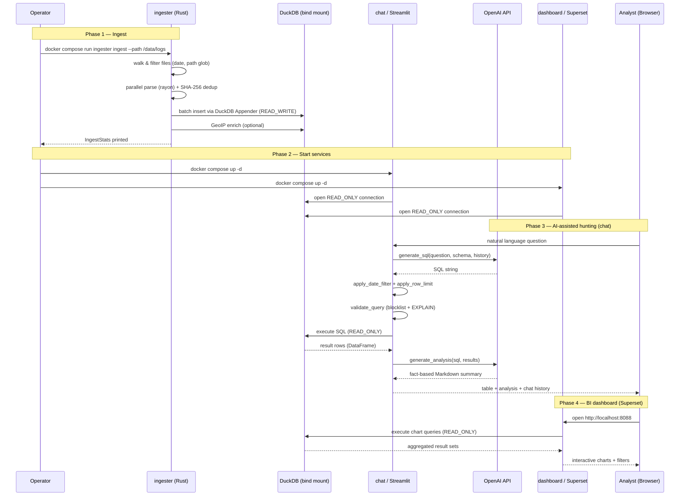

# 🪽THuntCloud🪽



## AWS CloudTrail Log Threat Hunting Tool
> SIEM-equivalent AWS CloudTrail threat hunting on a single ordinary laptop — no cloud infrastructure required.

[](LICENSE)
[](https://github.com/fukusuket/THuntCloud/actions/workflows/ci.yml)
[](docker/docker-compose.yml)
[](ingester/Cargo.toml)
[](agent/requirements.txt)

Drop in your CloudTrail logs, run one command, and start hunting threats immediately.

- **No-query hunting** — select a built-in hunt from the Streamlit dropdown and get instant results — no SQL knowledge required
- **GeoIP enrichment** — country, city, and ASN for every source IP via MaxMind GeoLite2
- **Built-in BI dashboard** — Apache Superset with pre-built CloudTrail charts
- **AWS Config visualization** — interactive resource graph with hierarchical layout (VPC / Subnet / EC2 nesting)
- **Single-command launch** — `docker compose up -d`
- **(Optional) AI-assisted analysis** — AI automatically analyses query result DataFrames and surfaces key findings in plain language

## Screenshots

### Built-in Queries and AI Chat (Streamlit UI) 


### Built-in Dashboard (Apache Superset)


---

## Architecture

Four Docker containers share one DuckDB file via a bind mount (`docker/data/db/`).

```
┌─────────────────────────────────────────────────────────────────┐
│                       Docker Compose                            │
│                                                                 │
│  ┌──────────────┐  ┌──────────────┐  ┌──────────┐  ┌─────────┐  │
│  │   ingester   │  │    agent     │  │config_viz│  │dashboard│  │
│  │  (Rust)      │  │  (Streamlit) │  │(FastAPI+ │  │(Superset│  │
│  │              │  │              │  │ React)   │  │        )│  │
│  │ CloudTrail   │  │  AI Chat     │  │ Resource │  │ Visualiz│  │
│  │ gz ingest    │  │  SQL gen/exec│  │  Graph   │  │         │  │
│  │ Config import│  │  READ_ONLY   │  │ READ_ONLY│  │READ_ONLY│  │
│  │ READ_WRITE   │  │              │  │          │  │         │  │
│  └──────┬───────┘  └──────┬───────┘  └────┬─────┘  └────┬────┘  │
│         └─────────────────┴───────────────┴─────────────┘       │
│                                  │                              │
│                         ┌────────▼─────┐                        │
│                         │   DuckDB     │                        │
│                         │ (Bind Mount) │                        │
│                         │   (SSD)      │                        │
│                         └──────────────┘                        │
└─────────────────────────────────────────────────────────────────┘
```

## Prerequisites

| Requirement | Details |
|-------------|---------|
| **Docker** | Docker Desktop or Docker Engine + Compose v2 |
| **Resources** | 16 GB RAM minimum, SSD recommended |
| **CloudTrail logs** | `.json` or `.json.gz` files exported from AWS |
| *(Optional)* **OpenAI API key** | Required for AI query generation |
| *(Optional)* **MaxMind GeoLite2** | `.mmdb` files for GeoIP enrichment |

---

## Quick Start

**Step 1.** Download CloudTrail logs from S3.

```bash
aws s3 cp s3://<your-bucket>/<your-prefix> <local-output-dir>/ --recursive --include "*.json.gz"
```

**Step 2.** Clone the repository, ingest logs, and start all services.

```bash
# Clone the repository
git clone https://github.com/fukusuket/THuntCloud.git

# Place the downloaded logs into the Docker logs directory
cp -r <local-output-dir>/ THuntCloud/docker/logs/

# Move to the Docker directory
cd THuntCloud/docker

# Ingest logs into DuckDB
docker compose --profile ingest run --rm ingester ingest --path /data/logs

# Start all services (agent + dashboard)
docker compose up -d --build
```

**Step 3.** 🪽 Open your browser and start hunting!🪽

- http://localhost:8501 — Built-in queries and AI Chat
- http://localhost:8088 — Dashboard (`admin` / `admin`)
- http://localhost:8502 — AWS Config resource graph

**(Optional)** Import AWS Config snapshots (VPC / Subnet / EC2 resource graph).

```bash
docker compose --profile ingest run --rm ingester config-import --path /data/config
```

**(Optional)** GeoIP enrichment.
Place [GeoLite2 `.mmdb` files](https://dev.maxmind.com/geoip/geolite2-free-geolocation-data) in `docker/data/geoip/`, then:

```bash
docker compose --profile ingest run --rm ingester ingest \
  --path /data/logs \
  --geoip-city /data/geoip/GeoLite2-City.mmdb \
  --geoip-asn  /data/geoip/GeoLite2-ASN.mmdb
```

---

## Common Commands

All commands are run from the `docker/` directory.

```bash
docker compose down && docker compose up -d --build      # Rebuild & restart
docker compose logs -f                                   # View logs
docker compose --profile resync run --rm superset-resync # Fix blank dashboard after re-ingest
```

---

## Modules

| Module | Language | Role | README |
|--------|----------|------|--------|
| `ingester` | Rust 1.85+ | CloudTrail log ingestion (READ_WRITE) | [ingester/README.md](ingester/README.md) |
| `agent` | Python 3.12+ / Streamlit | AI-assisted interactive chat for threat hunting (READ_ONLY) | [agent/README.md](agent/README.md) |
| `dashboard` | Apache Superset | BI visualization (READ_ONLY) | [dashboard/README.md](dashboard/README.md) |
| `config_viz` | FastAPI + React | AWS Config visualization (READ_ONLY) | [config_viz/README.md](config_viz/README.md) |

---

### End-to-End Sequence Diagram

The diagram below shows the full lifecycle from log ingestion through to a
completed AI-assisted threat hunting session.



---

## License

GNU Affero General Public License v3.0 — see [LICENSE](LICENSE) for details.

## Acknowledgements

This project exists thanks to these wonderful projects and datasets :)

- [Yamato Security](https://github.com/Yamato-Security) — [suzaku-sample-data](https://github.com/Yamato-Security/suzaku-sample-data)
- [Suzaku](https://github.com/Yamato-Security/suzaku) — Suzaku, a CloudTrail log analysis tool created by Yamato Security
- [flaws.cloud](http://flaws.cloud) — intentionally vulnerable AWS CloudTrail dataset
- [Apache Superset](https://superset.apache.org/) — BI platform
- [DuckDB](https://duckdb.org/) — embedded analytical database
- [SIEM on Amazon OpenSearch Service](https://github.com/aws-samples/siem-on-amazon-opensearch-service) — SIEM-like CloudTrail analytics reference implementation
- [AWS CloudTrail Lake query samples](https://github.com/aws-samples/cloud-trail-lake-query-samples) — CloudTrail Lake query examples
- [MaxMind GeoLite2](https://dev.maxmind.com/geoip/geolite2-free-geolocation-data) — GeoIP databases
