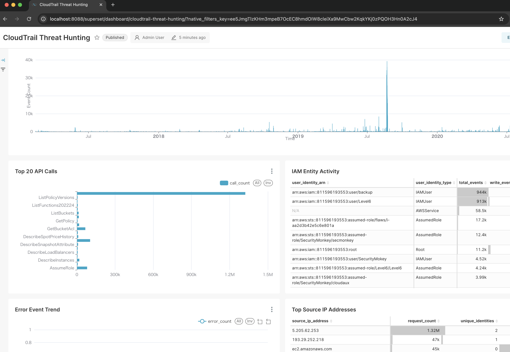
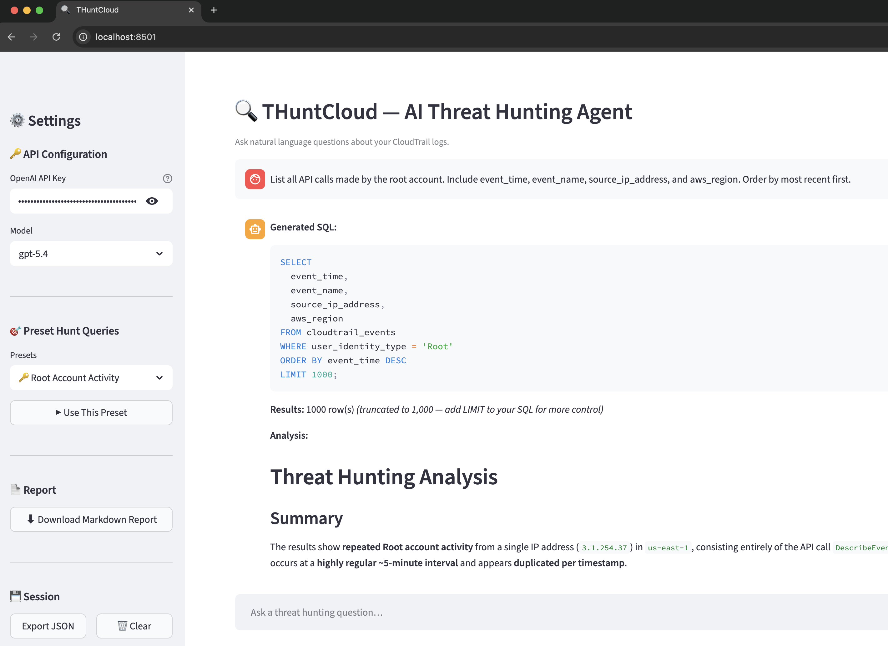

# THuntCloud

## AWS Log Threat Hunting Tool

> Locally-executed, AI-assisted threat hunting for AWS CloudTrail logs — no SIEM required.

[](LICENSE)
[](docker/docker-compose.yml)
[](ingester/Cargo.toml)
[](agent/requirements.txt)

## Overview

THuntCloud enables fast, AI-powered threat hunting against AWS CloudTrail logs directly on a local PC.

- **No SIEM required** — all analysis runs locally via DuckDB
- **AI-assisted** — natural language → SQL generation via OpenAI API (`gpt-5.4`)
- **High performance** — ingest 10 GB in under 5 minutes; supports 50 GB on 16 GB RAM
- **Built-in dashboard** — Apache Superset with pre-seeded CloudTrail dashboards
- **Single-command launch** — `docker compose up -d`

## Screenshots

### AI Agent (Streamlit UI)



### Dashboard (Apache Superset)



## Architecture

```
┌─────────────────────────────────────────────────────────┐
│                    Docker Compose                       │
│                                                         │
│  ┌──────────────┐   ┌──────────────┐  ┌─────────────┐   │
│  │   ingester   │   │    agent     │  │  dashboard  │   │
│  │  (Rust)      │   │  (Streamlit) │  │  (Superset) │   │
│  │              │   │              │  │             │   │
│  │ CloudTrail   │   │  AI-Agent    │  │ BI / Viz    │   │
│  │ gz ingest    │   │ SQL gen/exec │  │             │   │
│  │ READ_WRITE   │   │ READ_ONLY    │  │ READ_ONLY   │   │
│  └──────┬───────┘   └──────┬───────┘  └──────┬──────┘   │
│         └──────────────────┴─────────────────┘          │
│                            │                            │
│                    ┌───────▼──────┐                     │
│                    │   DuckDB     │                     │
│                    │  (Named Vol) │                     │
│                    │  (SSD)       │                     │
│                    └──────────────┘                     │
└─────────────────────────────────────────────────────────┘
```

## Quick Start

### Prerequisites

- Docker Desktop (or Docker Engine + Docker Compose v2)
- 16 GB RAM minimum, SSD recommended
- OpenAI API key (`gpt-5.4` access) — agent module requires this

### 1. Clone and configure

```bash
git clone https://github.com/fukusuket/THuntCloud.git
cd THuntCloud
export OPENAI_API_KEY="sk-..."   # Set your OpenAI API key
```

### 2. Place CloudTrail logs

```bash
# Your own logs
cp /path/to/cloudtrail/logs/*.json.gz docker/logs/
```

<details>
<summary>Or use sample data (flaws.cloud)</summary>

Download sample logs from [Yamato Security's suzaku-sample-data](https://github.com/Yamato-Security/suzaku-sample-data) (requires [Git LFS](https://git-lfs.com/)):

```bash
brew install git-lfs && git lfs install   # macOS

git clone --no-checkout --depth=1 https://github.com/Yamato-Security/suzaku-sample-data.git
cd suzaku-sample-data
git sparse-checkout init --cone
git sparse-checkout set aws/flaws.cloud
git checkout main
cd ..

cp suzaku-sample-data/aws/flaws.cloud/*.json.gz docker/logs/
```

</details>

### 3. Build and ingest logs

```bash
cd docker
docker compose --profile ingest build ingester
docker compose --profile ingest run --rm ingester ingest \
  --path /data/logs
```

### 4. Start all services

```bash
docker compose up -d --build
```

### 5. Open the UIs

| Service | URL | Credentials |
|---------|-----|-------------|
| Agent (AI hunting) | http://localhost:8501 | — |
| Dashboard (Superset) | http://localhost:8088 | `admin` / `admin` |

### Example queries

- `"Who accessed the S3 buckets and from which IP addresses?"`
- `"Show me all IAM-related API calls ordered by time"`
- `"List any failed authentication attempts"`

---

## Docker Operations

All commands are run from the `docker/` directory.

```bash
docker compose down && docker compose up -d              # Restart (keep data)
docker compose down && docker compose up -d --build      # Rebuild & restart
docker compose up -d superset                            # Dashboard only
docker compose up -d agent                               # Agent only
docker compose logs -f                                   # View logs
docker compose down -v                                   # Full reset (delete data)
```

### Re-ingest Logs

```bash
docker compose down
rm -f data/db/threat_hunting.db data/db/threat_hunting.db.wal
docker compose --profile ingest run --rm ingester ingest --path /data/logs
docker compose up -d --build
```

### Dashboard shows no data after ingest

If the Superset dashboard is blank after ingestion (especially after re-ingestion or on WSL2),
re-sync the dataset column metadata:

```bash
cd docker
docker compose --profile resync run --rm superset-resync
```

---

## WSL2 Setup

The default configuration works on **WSL2** as long as the project lives inside the
**WSL filesystem** (e.g. `/home/youruser/THuntCloud`).

> ⚠️ **Do NOT place the project under `/mnt/c/` (Windows filesystem).**  
> DuckDB file locking does not work reliably over the Windows filesystem from WSL.

### WSL2 Quick Start

```bash
# Clone into WSL filesystem (not /mnt/c/...)
git clone https://github.com/fukusuket/THuntCloud.git ~/THuntCloud
cd ~/THuntCloud/docker

# Verify Docker is accessible
docker info

# Follow the standard Quick Start from step 2 onwards
```

### WSL2 Troubleshooting

**Symptom**: Ingester succeeds but Superset dashboard shows no data.

**Root cause** (pre-fix, ≤ v0.x): The previous `docker-compose.yml` used a named volume
with `driver_opts.device: ./data/db`.  Docker Engine on Linux requires **absolute paths**
for named-volume bind mounts — relative paths are silently mis-resolved, so ingester and
Superset ended up using **different storage locations**.

The current `docker-compose.yml` uses per-service bind mounts (`./data/db:/data/db`),
which Docker Compose resolves correctly on all platforms including WSL2.

**If you still see blank charts after updating:**

```bash
cd docker

# Step 1 — verify the DB file was created
ls -lh data/db/threat_hunting.db

# Step 2 — confirm the table has rows
docker run --rm \
  -v "$(pwd)/data/db:/data/db" \
  -e DUCKDB_PATH=/data/db/threat_hunting.db \
  threat-hunting-ingester \
  sh -c 'duckdb /data/db/threat_hunting.db "SELECT COUNT(*) FROM cloudtrail_events"' \
  2>/dev/null || \
duckdb data/db/threat_hunting.db "SELECT COUNT(*) FROM cloudtrail_events"

# Step 3 — re-sync Superset dataset metadata
docker compose --profile resync run --rm superset-resync

# Step 4 — restart Superset to pick up changes
docker compose restart superset
```

**If you were using a previous version** (named volume `threat-hunting-duckdb`), clean up the stale volume first:

```bash
cd docker
docker compose down
docker volume rm threat-hunting-duckdb 2>/dev/null || true
# Then follow the Re-ingest procedure above
```

**If the DB file is missing or empty**, re-run the ingester:

```bash
docker compose down
rm -f data/db/threat_hunting.db data/db/threat_hunting.db.wal
docker compose --profile ingest run --rm ingester ingest --path /data/logs
docker compose up -d
docker compose --profile resync run --rm superset-resync
```


## Module Overview

| Module | Language / Framework | Role |
|--------|---------------------|------|
| `ingester` | Rust 1.85+ | Parse and load CloudTrail logs into DuckDB (READ_WRITE) |
| `agent` | Python 3.12+ / Streamlit | AI-Agent UI for interactive threat hunting (READ_ONLY) |
| `dashboard` | Apache Superset | BI visualization of log data (READ_ONLY) |

## Environment Variables

| Variable | Module | Default | Description |
|----------|--------|---------|-------------|
| `OPENAI_API_KEY` | agent | *(required)* | OpenAI API key |
| `OPENAI_MODEL` | agent | `gpt-5.4` | Primary AI model for SQL generation |
| `OPENAI_MODEL_LITE` | agent | `gpt-5.4-mini` | Lightweight model for quick tasks |
| `DUCKDB_PATH` | all | *(required)* | Path to DuckDB file inside container |
| `DUCKDB_READONLY` | agent | `true` | Force read-only mode |
| `RUST_LOG` | ingester | `info` | Rust log level (`trace`, `debug`, `info`, `warn`, `error`) |
| `SUPERSET_SECRET_KEY` | dashboard | `change-me-in-production` | Superset secret key |
| `SUPERSET_ADMIN_USERNAME` | dashboard | `admin` | Superset admin username |
| `SUPERSET_ADMIN_PASSWORD` | dashboard | `admin` | Superset admin password |
| `DUCKDB_HOST_PATH` | docker | `./data/db` | Host path for DuckDB volume bind (SSD recommended) |

## Proxy Environment (Corporate Network)

If `docker compose build` fails with SSL certificate errors behind a corporate proxy:

1. **Obtain** your proxy's root CA certificate in PEM format (`.crt`)
2. **Copy** it into each module directory:
   ```bash
   cp /path/to/custom-ca.crt ingester/custom-ca.crt
   cp /path/to/custom-ca.crt agent/custom-ca.crt
   cp /path/to/custom-ca.crt dashboard/custom-ca.crt
   ```
3. **Uncomment** the `(Proxy) Custom CA certificate` section in each Dockerfile (`ingester/Dockerfile`, `agent/Dockerfile`, `dashboard/Dockerfile`)
4. **Build normally** — `cd docker && docker compose build`

> If the Docker daemon itself needs proxy access, configure `~/.docker/config.json` with `httpProxy` / `httpsProxy` settings.

---

## Development

### Requirements

| Tool | Version | Purpose |
|------|---------|---------|
| Rust | 1.85+ | ingester development |
| Python | 3.12+ | agent development |
| Docker Desktop | Latest | Container orchestration |
| Docker Compose | v2 | Multi-service management |
| DuckDB CLI | 1.2+ | Ad-hoc database inspection (optional) |

### ingester (Rust)

```bash
cd ingester
cargo build
cargo test
cargo clippy -- -D warnings
cargo fmt --check
```

### agent (Python)

```bash
cd agent
python3 -m venv .venv && source .venv/bin/activate
pip install -r requirements.txt -r requirements-dev.txt
pytest
ruff check .
black --check .
```

### Useful Commands

```bash
# Inspect DuckDB directly
duckdb docker/data/db/threat_hunting.db "SELECT COUNT(*) FROM cloudtrail_events"

# Check container status
cd docker && docker ps --filter "name=threat-hunting" --format "table {{.Names}}\t{{.Status}}"
```

## License

Apache License 2.0 — see [LICENSE](LICENSE) for details.
See [NOTICE](NOTICE) for third-party license attributions.

## Acknowledgements

- **[Yamato Security](https://github.com/Yamato-Security)** — for providing the [suzaku-sample-data](https://github.com/Yamato-Security/suzaku-sample-data) repository, which includes the `flaws.cloud` CloudTrail sample logs used in the Quick Start guide.
- **[flaws.cloud](http://flaws.cloud)** — the intentionally vulnerable AWS environment whose CloudTrail logs serve as an excellent threat hunting practice dataset.
- **[Apache Superset](https://superset.apache.org/)** — the open-source BI platform powering the built-in dashboard.
- **[DuckDB](https://duckdb.org/)** — the embedded analytical database at the core of THuntCloud's data engine.

