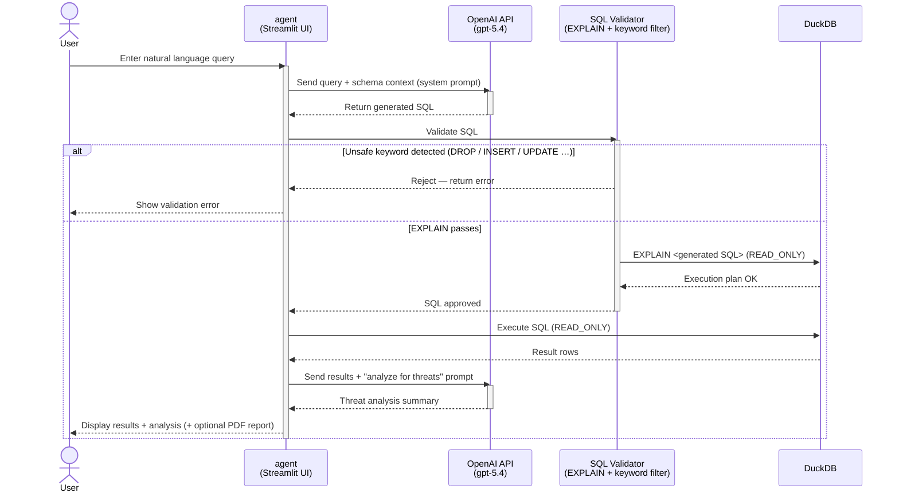

# agent

AI-assisted threat hunting module for THuntCloud.

Provides an interactive Streamlit UI where users enter natural language questions,
the AI (OpenAI API) generates DuckDB SQL queries, executes them against the
CloudTrail log database, and delivers a threat analysis summary.
This module **always** opens DuckDB in `READ_ONLY` mode.

---

## Table of Contents

- [Features](#features)
- [Quick Start](#quick-start)
- [Module Structure](#module-structure)
- [Processing Sequence](#processing-sequence)
- [SQL Safety Guards](#sql-safety-guards)
- [Built-in Hunts](#built-in-hunts)
- [Configuration](#configuration)
- [Development](#development)

---

## Features

| ID     | Feature                                                    | Status |
|--------|------------------------------------------------------------|--------|
| AGT-01 | Natural language → SQL generation via OpenAI API          | ✅ |
| AGT-02 | SQL safety validation (keyword blocklist + EXPLAIN)        | ✅ |
| AGT-03 | Row-limit cap (1 000 rows max, configurable)               | ✅ |
| AGT-04 | Date-range filter (UI sliders → CTE injection)             | ✅ |
| AGT-05 | AI threat analysis of query results                        | ✅ |
| AGT-06 | Threat hunting report generation (Markdown + PDF)          | ✅ |
| AGT-07 | Built-in preset hunts (`builtin_hunts.yaml`)               | ✅ |
| AGT-08 | Sensitive data redaction in reports                        | ✅ |

---

## Quick Start

```bash
# Run from docker/
docker compose up -d agent

# Open the UI
open http://localhost:8501
```

An `OPENAI_API_KEY` environment variable is required for SQL generation and
threat analysis. Built-in hunts with a `sql` field can be executed without an
API key.

---

## Module Structure

```
agent/
├── app.py                 # Streamlit entry point
├── llm.py                 # OpenAI API integration (SQL generation + analysis)
├── query.py               # DuckDB query execution, validation, date filter, row limit
├── report.py              # Threat hunting report generation (Markdown + sensitive data redaction)
├── schema.py              # CloudTrail table schema definitions (column list, descriptions)
├── config.py              # Configuration management (env vars)
├── builtin_hunts.yaml     # Pre-built threat hunting queries (categorised, label/prompt/sql)
├── prompts/
│   ├── __init__.py
│   └── system_prompt.py   # System prompt template for SQL generation
├── requirements.txt       # Runtime dependencies
├── requirements-dev.txt   # Dev/test dependencies
├── Dockerfile
├── pytest.ini             # Sets pythonpath = . so modules resolve as `llm`, not `agent.llm`
├── tests/
│   ├── conftest.py        # Shared fixtures (mock_openai_client, tmp_duckdb)
│   ├── test_config.py
│   ├── test_schema.py
│   ├── test_query.py
│   ├── test_llm.py
│   ├── test_report.py
│   └── test_app.py
└── AGENTS.md              # Copilot agent instructions
```

---

## Processing Sequence

### AI-Assisted Threat Hunting Flow



---

## SQL Safety Guards

Before executing any LLM-generated SQL, `query.py` applies three guards:

1. **Keyword blocklist** — rejects queries containing `INSERT`, `UPDATE`,
   `DELETE`, `DROP`, `ALTER`, `CREATE` (regex, word-boundary, case-insensitive).
2. **EXPLAIN validation** — runs `EXPLAIN <sql>` on the READ_ONLY connection
   before the real query.
3. **Row-limit cap** — `apply_row_limit()` wraps any query without a `LIMIT`
   clause in `SELECT * FROM (...) AS _limited LIMIT 1000`.

---

## Built-in Hunts

`builtin_hunts.yaml` ships categorised threat hunting queries with `label`,
`description`, `prompt`, and an optional `sql` field.

- Entries **with** `sql` can be executed directly — no OpenAI API key required.
- Entries **without** `sql` (only `prompt`) require an API key to generate SQL.

---

## Configuration

| Variable          | Required | Default        | Description                    |
|-------------------|----------|----------------|--------------------------------|
| `OPENAI_API_KEY`  | Yes      | —              | OpenAI API key                 |
| `DUCKDB_PATH`     | Yes      | —              | Path to DuckDB file            |
| `OPENAI_MODEL`    | No       | `gpt-5.4`      | Model for SQL gen + analysis   |
| `OPENAI_MODEL_LITE` | No     | `gpt-5.4-mini` | Lighter model (optional)       |

---

## Development

### Prerequisites

| Tool    | Version  | Install                         |
|---------|----------|---------------------------------|
| Python  | 3.12+    | `pyenv install 3.12`            |
| pip     | (bundled)| —                               |

```bash
cd agent
pip install -r requirements.txt -r requirements-dev.txt
```

### Test

```bash
# Run all tests
pytest

# Run with coverage
pytest --cov=. --cov-report=term-missing
```

### Lint & Format

```bash
ruff check .   # Lint
black .        # Format
```

