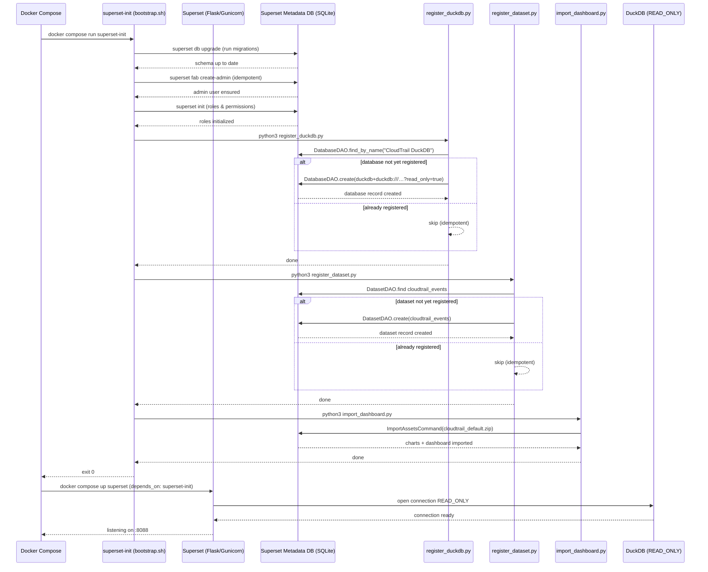
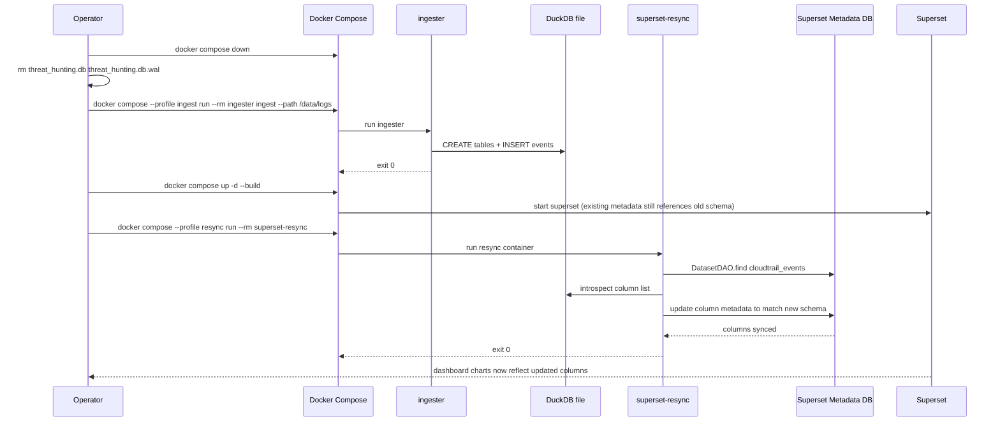

# dashboard

BI dashboard module for THuntCloud powered by Apache Superset.
Visualizes CloudTrail log data stored in DuckDB. Always opens DuckDB in **`READ_ONLY`** mode.

---

## Table of Contents

- [Quick Start](#quick-start)
- [Initialization Flow](#initialization-flow)
  - [Sequence Diagram — First Startup](#sequence-diagram--first-startup)
  - [Sequence Diagram — Re-ingest & Resync](#sequence-diagram--re-ingest--resync)
- [Pre-built Charts](#pre-built-charts)
- [Directory Structure](#directory-structure)
- [Configuration](#configuration)
- [Development](#development)

---

## Quick Start

```bash
# Run from docker/

# 1. (First time) Ingest logs
docker compose --profile ingest run --rm ingester ingest --path /data/logs

# 2. Start the dashboard
docker compose up -d superset
```

Open http://localhost:8088 (default credentials: `admin` / `admin`).

> **Security:** Change `SUPERSET_SECRET_KEY` and the admin password before
> exposing the service outside localhost.

---

## Initialization Flow

On first startup, the `superset-init` service runs automatically before
`superset` is started. All steps are **idempotent** — safe to re-run.

### Sequence Diagram — First Startup



---

### Sequence Diagram — Re-ingest & Resync

After re-ingesting logs from scratch, the dashboard's column metadata
may go stale. The `superset-resync` profile re-syncs the dataset.



---

## Pre-built Charts

The `cloudtrail_default.zip` import bundle contains the following charts:

| Chart | Type | Description |
|-------|------|-------------|
| **CloudTrail Events Over Time** | Time-series line | Event volume per hour/day |
| **Top 20 API Calls** | Bar chart | Most frequent `event_name` values |
| **IAM Entity Activity** | Bar chart | API calls grouped by `user_identity_type` |
| **Error Event Trend** | Time-series line | Events with a non-NULL `error_code` over time |
| **Top Source IP Addresses** | Bar chart | Most active `source_ip_address` values |

All charts are backed by the `cloudtrail_events` dataset and respect
Superset's native time-range and filter bar controls.

---

## Directory Structure

```
dashboard/
├── Dockerfile                          # Extends apache/superset:4.1.2 + duckdb-engine
├── superset_config.py                  # Superset Flask config (SECRET_KEY, DB URI, …)
├── assets/
│   ├── cloudtrail_default.zip          # Superset import ZIP (charts + dashboard + dataset)
│   ├── rebuild_zip.py                  # Regenerate the ZIP from cloudtrail_default/
│   └── cloudtrail_default/             # Source-of-truth dashboard definitions
│       ├── dashboard.yaml
│       ├── metadata.yaml
│       ├── databases/
│       ├── datasets/
│       └── charts/
└── init/
    ├── bootstrap.sh                    # Idempotent init script (runs in superset-init)
    ├── register_duckdb.py              # Register DuckDB connection via DatabaseDAO
    ├── register_dataset.py             # Register cloudtrail_events dataset
    └── import_dashboard.py             # Import cloudtrail_default.zip via ImportAssetsCommand
```

---

## Configuration

| Variable | Default | Description |
|----------|---------|-------------|
| `SUPERSET_SECRET_KEY` | `change-me-in-production` | Session signing key (**must change in production**) |
| `SUPERSET_ADMIN_USERNAME` | `admin` | Admin username |
| `SUPERSET_ADMIN_PASSWORD` | `admin` | Admin password (**must change in production**) |
| `DUCKDB_PATH` | `/data/db/threat_hunting.db` | DuckDB file path (in container) |
| `DUCKDB_HOST_PATH` | `./data/db` | Host-side DuckDB directory (bind mount) |

---

## Development

```bash
cd docker

# Build the custom Superset image
docker compose build superset

# Verify duckdb-engine is installed in the image
docker compose run --rm superset python -c "import duckdb_engine; print('OK')"

# Re-run initialization (idempotent — safe to run multiple times)
docker compose run --rm superset-init

# Fix blank / stale charts after re-ingest
docker compose --profile resync run --rm superset-resync
```

### Modifying dashboard definitions

1. Edit YAML files under `dashboard/assets/cloudtrail_default/`.
2. Regenerate the ZIP:
   ```bash
   cd dashboard/assets
   python rebuild_zip.py
   ```
3. Re-run initialization to import the updated ZIP:
   ```bash
   cd docker
   docker compose run --rm superset-init
   ```

The CI pipeline (`dashboard-yaml` job) validates all YAML files and verifies
that the ZIP contains all required files on every push.
