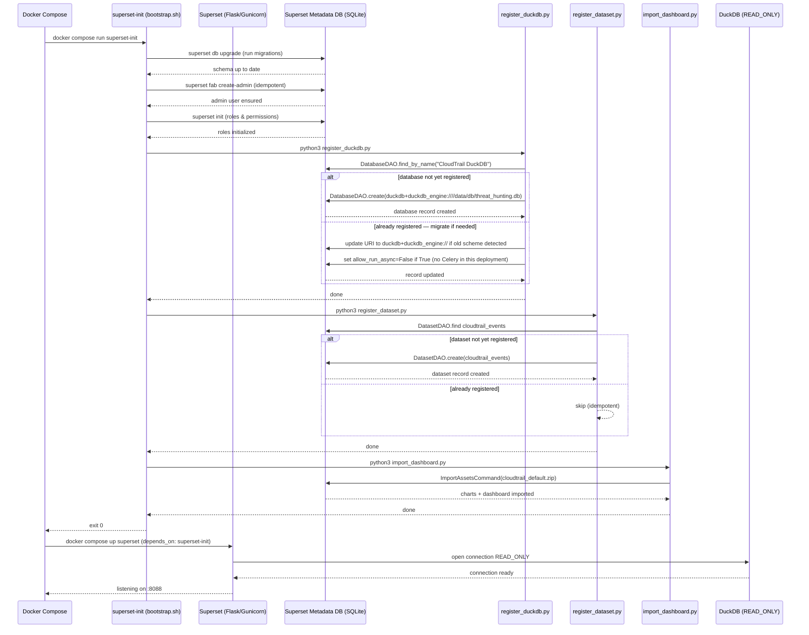
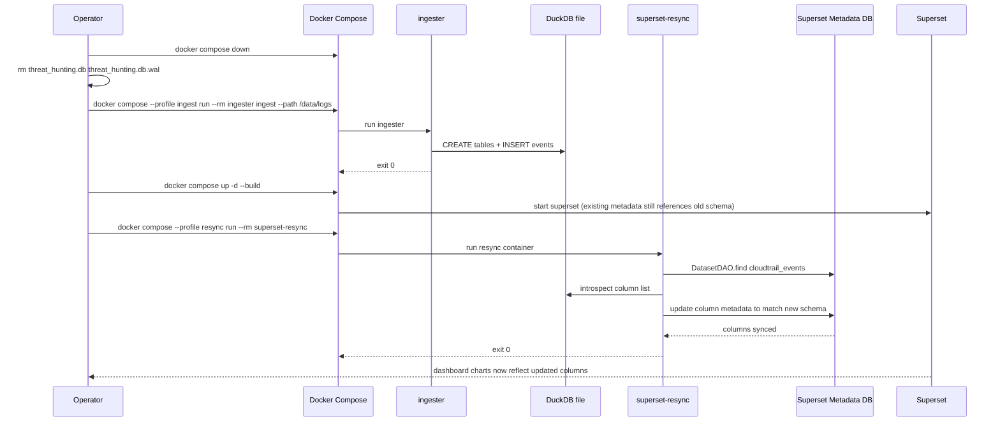

# dashboard

BI dashboard module for THuntCloud powered by Apache Superset.
Visualizes CloudTrail log data stored in DuckDB. Always opens DuckDB in **`READ_ONLY`** mode.

---

## Table of Contents

- [Quick Start](#quick-start)
- [Initialization Flow](#initialization-flow)
  - [Sequence Diagram — First Startup](#sequence-diagram--first-startup)
  - [Sequence Diagram — Re-ingest & Resync](#sequence-diagram--re-ingest--resync)
- [Pre-built Charts](#pre-built-charts)
- [Directory Structure](#directory-structure)
- [Configuration](#configuration)
- [Development](#development)
- [Troubleshooting](#troubleshooting)

---

## Quick Start

```bash
# Run from docker/

# 1. (First time) Ingest logs
docker compose --profile ingest run --rm ingester ingest --path /data/logs

# 2. Start the dashboard
docker compose up -d superset
```

Open http://localhost:8088 (default credentials: `admin` / `admin`).

> **Security:** Change `SUPERSET_SECRET_KEY` and the admin password before
> exposing the service outside localhost.

---

## Initialization Flow

On first startup, the `superset-init` service runs automatically before
`superset` is started. All steps are **idempotent** — safe to re-run.

### Sequence Diagram — First Startup



---

### Sequence Diagram — Re-ingest & Resync

After re-ingesting logs from scratch, the dashboard's column metadata
may go stale. The `superset-resync` profile re-syncs the dataset.



---

## Pre-built Charts

The `cloudtrail_default.zip` import bundle contains **50 charts** across 6 tabs.

| Tab | Charts | Key Content |
|-----|:------:|-------------|
| 🔑 Identity & Access | 9 | Root usage · console logins · MFA trend · login heatmap · privilege escalation · SSO · AssumeRole · Organizations |
| 🎯 Threat Detection | 10 | Defense evasion · Config/EventBridge/CloudWatch tampering · write-read ratio · throttling spikes · NACL/route changes · access denied |
| 🗄 Data & Infrastructure | 9 | Top API calls · region activity · source IPs · user agents · Secrets Manager · AssumedRole · Route53 · SSM · RDS/EC2 snapshots · S3 policy · EKS/ECR |
| 🌍 GeoIP Intelligence | 4 | World map · top countries/cities/ASNs (requires MaxMind GeoLite2) |
| 🕒 Temporal Analysis | 6 | First/last seen per API/identity/IP/user-agent · dormant accounts · velocity spikes |
| 🚨 High-Risk API Monitor | 7 | HRM timeseries · top calls/actors/IPs · defense evasion detail · credential access detail · by region |

All charts are backed by the `cloudtrail_events` dataset and respect
Superset's native time-range and filter bar controls.

---

## Directory Structure

```
dashboard/
├── Dockerfile                          # Extends apache/superset:6.1.0 + duckdb-engine (uv)
├── superset_config.py                  # Superset Flask config (SECRET_KEY, DB URI, dialect registration)
├── assets/
│   ├── cloudtrail_default.zip          # Superset import ZIP (50 charts + dashboard + dataset)
│   ├── rebuild_zip.py                  # Regenerate the ZIP from cloudtrail_default/
│   └── cloudtrail_default/             # Source-of-truth dashboard definitions
│       ├── dashboard.yaml              # 6-tab layout, 50 CHART position entries
│       ├── metadata.yaml
│       ├── databases/
│       │   └── CloudTrail_DuckDB.yaml  # duckdb+duckdb_engine:// URI, allow_run_async: false
│       ├── datasets/
│       └── charts/                     # 50 chart YAML files (DSH-01 to DSH-48)
├── init/
│   ├── bootstrap.sh                    # Idempotent init script (runs in superset-init)
│   ├── register_duckdb.py              # Register DuckDB connection; auto-migrates old URI/settings
│   ├── register_dataset.py             # Register cloudtrail_events dataset
│   └── import_dashboard.py             # Import cloudtrail_default.zip via ImportAssetsCommand
└── tests/
    ├── test_chart_yaml.py
    ├── test_dashboard_yaml.py
    ├── test_dockerfile.py
    ├── test_init_scripts.py
    ├── test_rebuild_zip.py
    └── test_superset_config.py
```

---

## Configuration

| Variable | Default | Description |
|----------|---------|-------------|
| `SUPERSET_SECRET_KEY` | `change-me-in-production` | Session signing key (**must change in production**) |
| `SUPERSET_ADMIN_USERNAME` | `admin` | Admin username |
| `SUPERSET_ADMIN_PASSWORD` | `admin` | Admin password (**must change in production**) |
| `DUCKDB_PATH` | `/data/db/threat_hunting.db` | DuckDB file path (in container) |
| `DUCKDB_HOST_PATH` | `./data/db` | Host-side DuckDB directory (bind mount) |

### Key design decisions

| Setting | Value | Reason |
|---------|-------|--------|
| `allow_run_async` | `False` | No Celery worker in this deployment. `True` causes SQL Lab Issue 1035: *"Failed to start remote query on a worker."* |
| SQLAlchemy URI | `duckdb+duckdb_engine:////…` | Explicit driver suffix bypasses SQLAlchemy 2.x entry-point auto-discovery, preventing *"Can't load plugin: sqlalchemy.dialects:duckdb.duckdb_engine"* |
| `registry.register()` | both `"duckdb"` and `"duckdb.duckdb_engine"` | SA2 normalizes `+` → `.` when looking up dialect; both keys must be registered to cover all URI forms |
| Base image | `apache/superset:6.1.0` | SQLAlchemy 2.x support |
| Package install | `uv pip install --python /app/.venv` | Superset 6.x uses a uv-managed venv that has no `pip` module; bare `pip install` installs to the wrong Python |

---

## Development

```bash
cd docker

# Build the custom Superset image
docker compose build superset

# Verify duckdb-engine is installed in the image
docker compose run --rm superset python -c "import duckdb_engine; print('OK')"

# Re-run initialization (idempotent — safe to run multiple times)
docker compose run --rm superset-init

# Fix blank / stale charts after re-ingest
docker compose --profile resync run --rm superset-resync
```

### Modifying dashboard definitions

1. Edit YAML files under `dashboard/assets/cloudtrail_default/`.
2. Regenerate the ZIP:
   ```bash
   cd dashboard/assets
   python rebuild_zip.py
   ```
3. Re-run initialization to import the updated ZIP:
   ```bash
   cd docker
   docker compose run --rm superset-init
   ```

### Running tests

```bash
cd dashboard
python3 -m pytest tests/ -v
```

The test suite (281 tests) covers:
- `test_chart_yaml.py` — required fields and dataset UUID in all chart YAMLs
- `test_dashboard_yaml.py` — layout structure, cross-references, native filters
- `test_dockerfile.py` — base image version, duckdb-engine constraint, uv install, build-time import check
- `test_init_scripts.py` — URI scheme, `allow_run_async` absence, idempotent migration logic
- `test_rebuild_zip.py` — ZIP structure and chart coverage
- `test_superset_config.py` — feature flags, dialect registration

The CI pipeline (`dashboard-yaml` job) validates all YAML files and verifies
that the ZIP contains all required files on every push.

---

## Troubleshooting

### SQL Lab: "Failed to start remote query on a worker" (Issue 1035)

**Cause:** The database connection was registered with `allow_run_async=True`, which
tells Superset to submit SQL Lab queries to a Celery worker. This deployment has no
Celery worker or Redis broker, so the submission fails immediately.

**Fix (automatic):** `register_duckdb.py` detects `allow_run_async=True` on existing
database connections and sets it to `False` at every `superset-init` run.

**Manual fix** (if needed):
1. Open Superset → **Settings** → **Database Connections**
2. Edit **CloudTrail DuckDB**
3. In **Advanced** → uncheck **Allow Asynchronous Query Execution**
4. Save

---

### "Can't load plugin: sqlalchemy.dialects:duckdb.duckdb_engine"

**Cause:** SQLAlchemy 2.x normalizes the URI driver separator (`duckdb+duckdb_engine://`
→ lookup key `duckdb.duckdb_engine`) and falls back to entry-point discovery, which
can fail depending on importlib.metadata cache state.

**Fix:** `superset_config.py` explicitly registers both dialect keys:
```python
registry.register("duckdb", "duckdb_engine", "Dialect")
registry.register("duckdb.duckdb_engine", "duckdb_engine", "Dialect")
```
This is applied at Superset startup and requires no user action.

---

### "No module named 'duckdb_engine'" at Docker build time

**Cause:** Superset 6.x uses a uv-managed virtual environment at `/app/.venv`.
The venv intentionally omits `pip`, so `pip install` and `python3 -m pip install`
fail or install to the wrong location.

**Fix:** The Dockerfile uses `uv pip install --python /app/.venv` to install
directly into the venv:
```dockerfile
RUN uv pip install --python /app/.venv --no-cache-dir "duckdb-engine>=0.14.0"
RUN python3 -c 'import duckdb_engine'   # build-time verification
```
