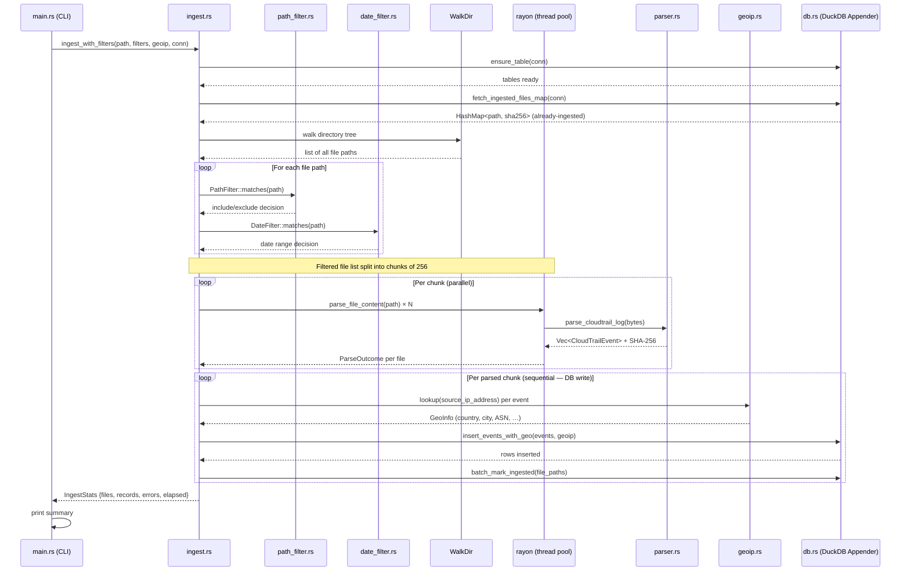
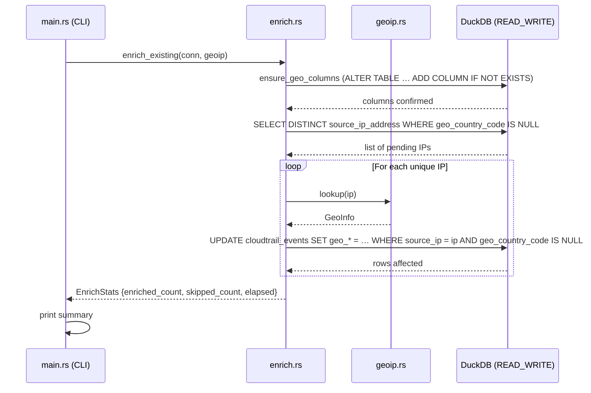

# ingester

AWS CloudTrail log ingestion module for THuntCloud.

Reads CloudTrail log files (`.json` / `.json.gz`) from the local filesystem,
parses them, optionally enriches each event with GeoIP data, and inserts all
records into DuckDB via high-throughput batch appends.
This is the **only** component that opens DuckDB in `READ_WRITE` mode.

---

## Table of Contents

- [Quick Start](#quick-start)
- [CLI Reference](#cli-reference)
- [Processing Pipeline](#processing-pipeline)
  - [Sequence Diagram — ingest](#sequence-diagram--ingest)
  - [Sequence Diagram — enrich](#sequence-diagram--enrich)
- [Database Schema](#database-schema)
- [Module Structure](#module-structure)
- [Development](#development)

---

## Quick Start

```bash
# Ingest a directory
ingester ingest --path /logs/cloudtrail/ --db /data/threat_hunting.db

# Date-range filter (January 2024 only)
ingester ingest --path /logs/ --from 20240101 --to 20240131

# Path-pattern filter (CloudTrail logs only, skip a region)
ingester ingest --path /logs/ --include "*CloudTrail*" --exclude "*ap-northeast-3*"

# With GeoIP enrichment
ingester ingest --path /logs/ \
  --geoip-city    /data/geoip/GeoLite2-City.mmdb \
  --geoip-asn     /data/geoip/GeoLite2-ASN.mmdb

# Strip low-signal fields from requestParameters / responseElements (lean DB)
ingester ingest --path /logs/ --strip-fields

# Strip both low-signal fields AND the raw_event column (smallest possible DB)
ingester ingest --path /logs/ --strip-fields --strip-raw-event \
  --db /data/lean_hunting.db

# Back-fill GeoIP data on an existing database (no re-ingest needed)
ingester enrich \
  --geoip-city /data/geoip/GeoLite2-City.mmdb \
  --geoip-asn  /data/geoip/GeoLite2-ASN.mmdb
```

---

## CLI Reference

### `ingest`

```
ingester ingest --path <PATH>
               [--db <PATH>]              DuckDB file (default: /data/db/threat_hunting.db)
               [--from <YYYYMMDD>]        Include files on or after this date
               [--to   <YYYYMMDD>]        Include files on or before this date
               [--include <GLOBS>]        Comma-separated glob patterns to include
               [--exclude <GLOBS>]        Comma-separated glob patterns to exclude
               [--workers <N>]            Parallel parse threads (default: CPU count)
               [--no-progress]            Disable progress bar
               [--geoip-city    <PATH>]   GeoLite2-City.mmdb
               [--geoip-country <PATH>]   GeoLite2-Country.mmdb (lighter alternative)
               [--geoip-asn     <PATH>]   GeoLite2-ASN.mmdb
               [--strip-fields]           Strip low-signal keys from requestParameters / responseElements
               [--strip-raw-event]        Write NULL for raw_event column (saves storage)
```

#### `--strip-fields`

Removes a fixed list of low-signal CloudTrail keys from `requestParameters` and
`responseElements` before they are written to DuckDB.  The categories stripped are:

| Category | Keys |
|----------|------|
| Pagination / size limits | `maxResults`, `MaxResults`, `maxItems`, `MaxItems`, `nextToken`, `NextToken`, `marker`, `Marker`, `pageSize`, `PageSize` |
| Idempotency / dry-run | `dryRun`, `DryRun`, `clientToken`, `ClientToken`, `clientRequestToken`, `ClientRequestToken` |
| Opaque ephemeral credentials | `sessionToken`, `SessionToken`, `secretAccessKey`, `SecretAccessKey` |
| AWS catalogue / reference data | `eventCategoriesMapList`, `reservedNodeOfferings`, `sslPolicies`, `orderableClusterOptions` |
| Query-time filter echoes | `filterSet`, `ownersSet` |
| Redundant transport headers | `Host`, `host` |

The stripping is recursive (nested objects and arrays are also processed).
The `raw_event` column is **never** modified by this flag, so the full original
record is always recoverable via full-text search on that column.

#### `--strip-raw-event`

Writes `NULL` instead of the full JSON blob to the `raw_event` column.
All Step-A extended columns (`user_identity_access_key_id`,
`session_mfa_authenticated`, `resources`, `tls_*`, etc.) are still populated,
so investigation queries that target dedicated columns continue to work.
Only the unscoped full-text fallback via `WHERE raw_event LIKE …` is no longer
available.

Combine with `--strip-fields` to produce the **smallest possible DB** for
high-volume CloudTrail data.  Use `--db <path>` to write to a dedicated file.

### `enrich`

```
ingester enrich
               [--db <PATH>]
               [--geoip-city    <PATH>]
               [--geoip-country <PATH>]
               [--geoip-asn     <PATH>]
```

**DB path resolution order:** `--db` CLI arg → `DUCKDB_PATH` env var → `/data/db/threat_hunting.db`

`--include`/`--exclude` glob patterns use `*` that crosses `/` boundaries.
Files without a recognisable `yyyy/mm/dd` date segment in their path are always included.

---

## Processing Pipeline

### Sequence Diagram — `ingest`



**Key design points:**

| Aspect | Detail |
|--------|--------|
| Parallelism | File parsing runs in a `rayon` thread pool (chunk size 256). DB writes are serial (single writer). |
| Deduplication | SHA-256 of raw bytes is checked against `ingested_files` before inserting. Duplicate files are silently skipped. |
| Memory cap | `sync_channel` with depth 2 keeps at most 3 chunks (≈768 MB worst-case) in flight at once. |
| Batch insert | `duckdb::Appender` is used instead of individual `INSERT` statements for high throughput. |
| GeoIP | Lookup is done per-event in the insert loop. Private/reserved IPs return `None` and are stored as `NULL`. |

---

### Sequence Diagram — `enrich`

The `enrich` command back-fills geo columns on rows that were originally
ingested without a GeoIP database.



---

## Database Schema

### `cloudtrail_events` (24 columns)

**Core (17):**

| Column | Type | Description |
|--------|------|-------------|
| `event_time` | TIMESTAMP | Time the API call was made |
| `event_name` | VARCHAR | API action name (e.g. `GetCallerIdentity`) |
| `event_source` | VARCHAR | AWS service endpoint (e.g. `sts.amazonaws.com`) |
| `aws_region` | VARCHAR | AWS region of the API call |
| `source_ip_address` | VARCHAR | Caller IP address |
| `user_agent` | VARCHAR | HTTP User-Agent of the caller |
| `user_identity_type` | VARCHAR | IAM identity type (Root, IAMUser, AssumedRole, …) |
| `user_identity_arn` | VARCHAR | Full ARN of the principal |
| `user_identity_account_id` | VARCHAR | AWS account ID |
| `request_parameters` | VARCHAR | JSON blob of request parameters |
| `response_elements` | VARCHAR | JSON blob of response elements |
| `error_code` | VARCHAR | AWS error code (NULL on success) |
| `error_message` | VARCHAR | AWS error message (NULL on success) |
| `read_only` | BOOLEAN | `true` if the event is a read-only action |
| `event_type` | VARCHAR | CloudTrail event type (`AwsApiCall`, `AwsConsoleSignIn`, …) |
| `recipient_account_id` | VARCHAR | Account that received the event |
| `raw_event` | VARCHAR | Full raw JSON of the CloudTrail record |

**GeoIP (7, nullable):**

| Column | Type | Description |
|--------|------|-------------|
| `geo_country_code` | VARCHAR | ISO 3166-1 alpha-2 country code |
| `geo_country_name` | VARCHAR | Country name |
| `geo_city` | VARCHAR | City name |
| `geo_latitude` | DOUBLE | Latitude |
| `geo_longitude` | DOUBLE | Longitude |
| `geo_asn` | VARCHAR | Autonomous System Number |
| `geo_org` | VARCHAR | AS organization name |

JSON blobs (`request_parameters`, `response_elements`, `raw_event`) are stored as `VARCHAR`.
Use `json_extract_string(column, '$.field')` for ad-hoc queries.

### `ingested_files`

| Column | Type | Description |
|--------|------|-------------|
| `file_path` | VARCHAR (PK) | Absolute path of the ingested file |
| `sha256` | VARCHAR | SHA-256 hex digest of the raw file bytes |
| `ingested_at` | TIMESTAMP | Timestamp when the file was first ingested |

---

## Module Structure

```
ingester/
├── Cargo.toml
├── src/
│   ├── main.rs           # CLI entry point (clap) — subcommands: ingest, enrich
│   ├── lib.rs            # Public API re-exports
│   ├── parser.rs         # CloudTrail JSON parsing (serde_json)
│   ├── db.rs             # DuckDB schema management + batch insert (Appender) + geo ensure
│   ├── ingest.rs         # Pipeline orchestration (walk → filter → parallel parse → insert)
│   ├── enrich.rs         # Geo back-fill for existing rows (UPDATE per unique IP)
│   ├── geoip.rs          # MaxMind GeoLite2 lookup + private-IP classification
│   ├── field_filter.rs   # --strip-fields: recursive JSON key removal (FieldFilter)
│   ├── date_filter.rs    # --from / --to filter (extracts yyyy/mm/dd from path)
│   ├── path_filter.rs    # --include / --exclude glob filter
│   └── progress.rs       # Progress bar wrapper (indicatif)
└── tests/
    ├── cli_test.rs           # CLI integration tests
    ├── integration_test.rs   # End-to-end ingest tests with a real DuckDB
    └── testdata/             # Sample CloudTrail JSON / gz fixtures
```

---

## Development

> **Note:** The `duckdb` crate compiles libduckdb from source on first build.
> This can take **5–10 minutes**. Subsequent builds are fast thanks to Cargo's incremental compilation.

```bash
cd ingester

cargo build                   # Debug build
cargo build --release         # Release build

cargo test                    # All tests (unit + integration + CLI)
cargo test --lib              # Unit tests only
cargo clippy -- -D warnings   # Lint
cargo fmt                     # Format
```

### Environment variables (development)

| Variable | Description |
|----------|-------------|
| `DUCKDB_PATH` | Override the default DB path for ad-hoc testing |
| `RAYON_NUM_THREADS` | Limit the rayon thread pool size |
| `GEOIP_CITY_PATH` | Path to GeoLite2-City.mmdb |
| `GEOIP_COUNTRY_PATH` | Path to GeoLite2-Country.mmdb |
| `GEOIP_ASN_PATH` | Path to GeoLite2-ASN.mmdb |

